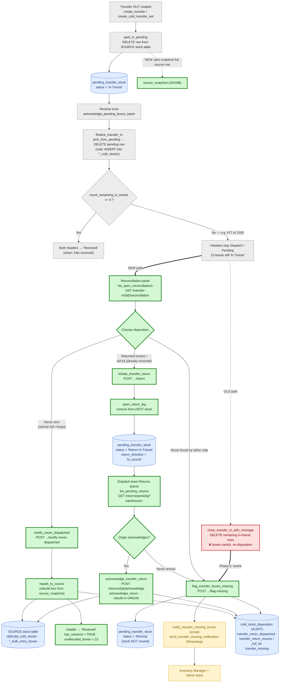
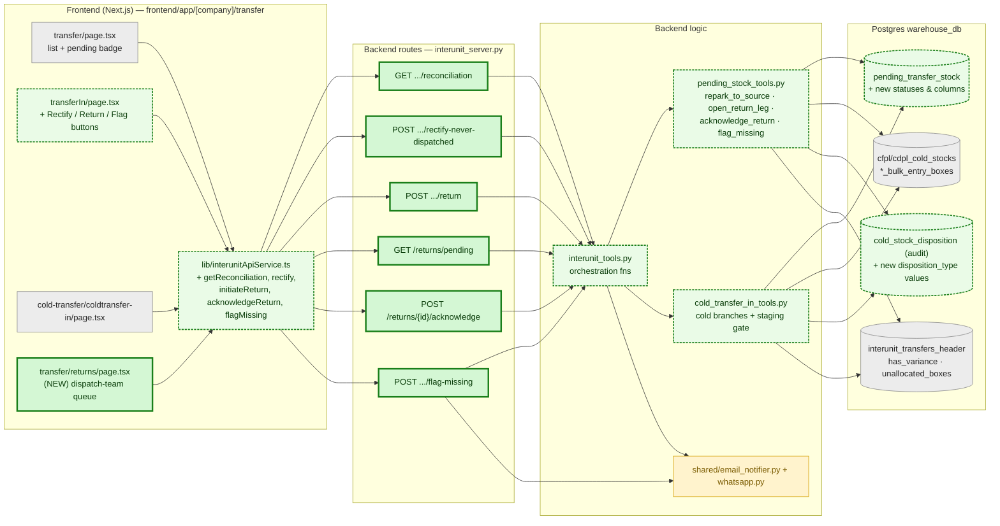
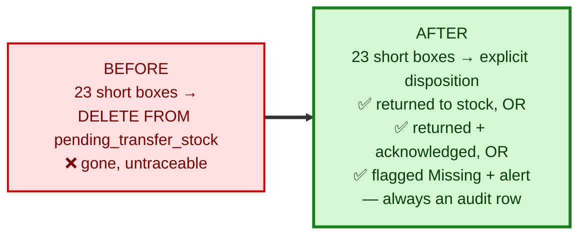

# Transfer Reconciliation & Revert — Process Flow

Companion to [2026-06-19-transfer-reconciliation-and-revert-plan.md](2026-06-19-transfer-reconciliation-and-revert-plan.md).
Open in a Markdown **preview** pane to render the Mermaid diagrams.

**Legend**

| Colour | Meaning |
|---|---|
| ⬜ Grey | **Existing** today — unchanged |
| 🟥 Red | **Existing GAP** being replaced (the blind write-off) |
| 🟩 Green | **NEW** in this plan |
| 🟦 Blue | Database table / stock store |
| 🟨 Yellow | Notification (existing infra, new trigger) |

---

## 1. End-to-end process flow

---

## 2. What connects to what (data + control wiring)

> 🟩 solid green = brand-new file/route/function · 🟩 dashed green = **existing file, modified/extended** · ⬜ grey = unchanged.

---

## 3. Stock-movement summary (where each box ends up)

| Disposition | Trigger (NEW) | Box leaves | Box lands | 2nd-party ack | Alert | Header outcome |
|---|---|---|---|---|---|---|
| In-transit (no action) | — | source (already) | still `pending_transfer_stock` | — | — | stays Dispatch/Pending |
| **Never dispatched** | `rectify_never_dispatched` | `pending_transfer_stock` | **back to SOURCE stock** | No | — | Received + `has_variance` |
| **Return excess** | `initiate_transfer_return` | DEST stock | SOURCE (on ack) | **Origin acks** | — | Received-short |
| **Return full lot** | `initiate_transfer_return` | DEST stock | SOURCE (on ack) | **Origin acks** | — | Received-short |
| **Missing** | `flag_transfer_boxes_missing` | nothing moved | `status='Missing'` | No | **Email + WhatsApp** | can close |

---

## 4. The single most important change

**Invariant the new design enforces:** no box may leave `pending_transfer_stock` without a `cold_stock_disposition` audit row — closing the "leaked in the system and never found" hole.
