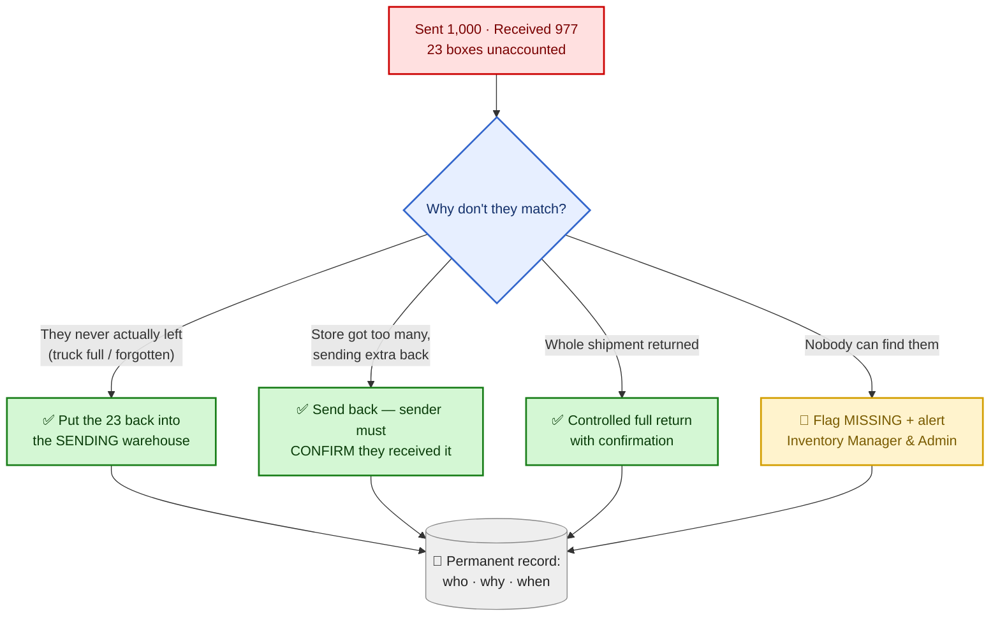
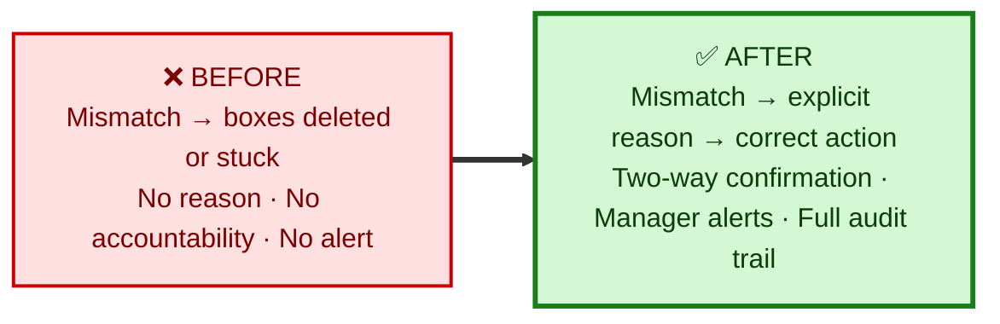
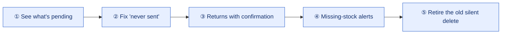

# Transfer Reconciliation & Revert
### Closing the gap on stock that goes "missing" between warehouses
*Pitch deck — open in Markdown preview. One section = one slide.*

---

## 1 · The one-liner

> When stock moves between our warehouses and the count received doesn't match the count sent, today there is **no clean way to resolve the difference** — so stock quietly "leaks" out of the system.
>
> **We're building a control layer that forces every mismatch to be explained, routed to the right place, and recorded — and alerts management the moment stock is genuinely lost.**

---

## 2 · The problem, in plain terms

We dispatch **1,000 boxes** from Warehouse A to Warehouse B. Only **977** are received.

**Where are the other 23?** Right now, the system can't answer that.

Today there are only two outcomes, and both are bad:

| Today's option | What actually happens | Business impact |
|---|---|---|
| Leave it "pending" | The 23 boxes sit in limbo forever | Stock counts stay wrong; nobody follows up |
| "Close the shortage" | The 23 boxes are **silently deleted** | Stock vanishes with **no record** of where it went or who's accountable |

**Net effect:** inventory inaccuracy, hidden shrinkage, warehouse-vs-warehouse disputes, and zero accountability.

---

## 3 · Why it matters now

- 📦 **Stock accuracy** drives planning, dispatch, and audits — a 23-box error compounds across hundreds of transfers.
- 🔍 **No traceability** — when stock disappears, there's no "who, why, when."
- 🤝 **Disputes** — Warehouse A says "we sent it," Warehouse B says "never arrived," and nothing settles it.
- 🚨 **No alerts** — genuinely lost stock is never escalated to anyone.

---

## 4 · What we're building

A **Reconciliation & Revert** layer on top of the existing transfer screens. Whenever sent ≠ received, the user must pick **one explicit reason**, and the system does the right thing automatically — and keeps a permanent record.

---

## 5 · The five real situations it handles

| # | Situation (real words from the floor) | What the system does |
|---|---|---|
| **1** | "How many are still not received?" | **Shows it clearly** — e.g. *23 of 1,000 pending* on the transfer |
| **2** | "We received 977 — the other 23 never left (truck was full / we forgot)" | **One-click rectify** — the 23 go straight **back into the sending warehouse's stock**, with a reason and an approver |
| **3** | "Store only needed 977 but got 1,000 — sending 23 back" | Opens a **return** — and the **original warehouse must confirm receipt**, so it can't get lost on the way back |
| **4** | "The whole lot is coming back" | Same controlled return, **for the entire shipment**, with confirmation |
| **5** | "Nobody can find the 23 — not us, not them" | **Flags them MISSING** and instantly **emails + WhatsApps the Inventory Manager and Admin team** |

---

## 6 · Before vs. After

---

## 7 · The value

- ✅ **Accountability** — every adjustment captures *who decided, why, and when*.
- ✅ **No silent loss** — stock can never disappear without a record.
- ✅ **Two-way confirmation** — returns must be acknowledged by the receiving end, so nothing "leaks in transit."
- ✅ **Real-time escalation** — truly missing stock pings management on email + WhatsApp immediately.
- ✅ **Accurate inventory** — the sending warehouse's count is corrected the moment a box is found to have never left.
- ✅ **Dispute resolution** — a clear paper trail settles "we sent it / we never got it."

---

## 8 · Low risk to deliver

- 🧩 **Builds on what we already have** — same transfer screens, same email & WhatsApp tools the business already uses for other alerts. No rip-and-replace.
- 🪜 **Phased rollout** — each step ships independently and is reversible.
- 🔒 **Permission-controlled** — only authorised users can return stock or write off missing boxes.

---

## 9 · What we need from you (3 quick decisions)

1. **Approvals** — who is allowed to return stock or mark boxes as missing? (e.g. warehouse leads, inventory manager)
2. **Alert recipients** — exact **email addresses and WhatsApp number** for the Inventory Manager and Admin team.
3. **Auto-escalation** — should boxes stuck in limbo beyond *X days* be flagged missing automatically, or only by hand?

---

## 10 · The bottom line

> **Every box is accounted for — returned, confirmed, or flagged. Nothing disappears without a name, a reason, and a timestamp.**
