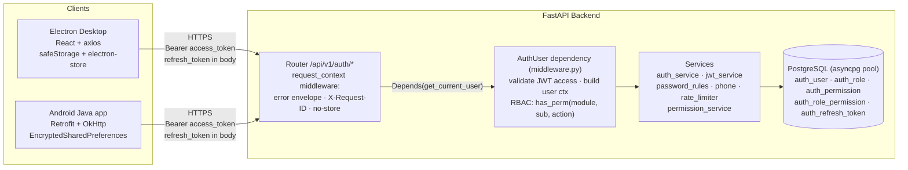
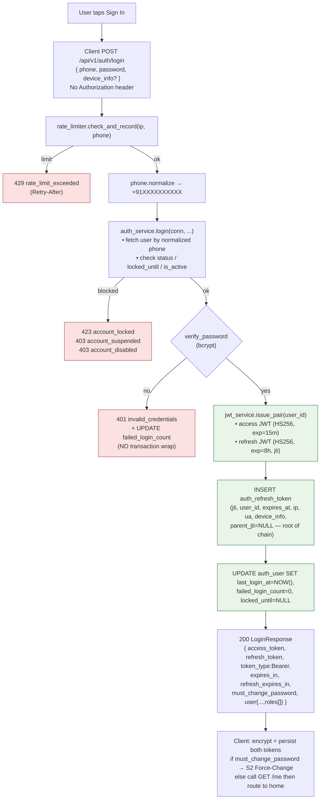
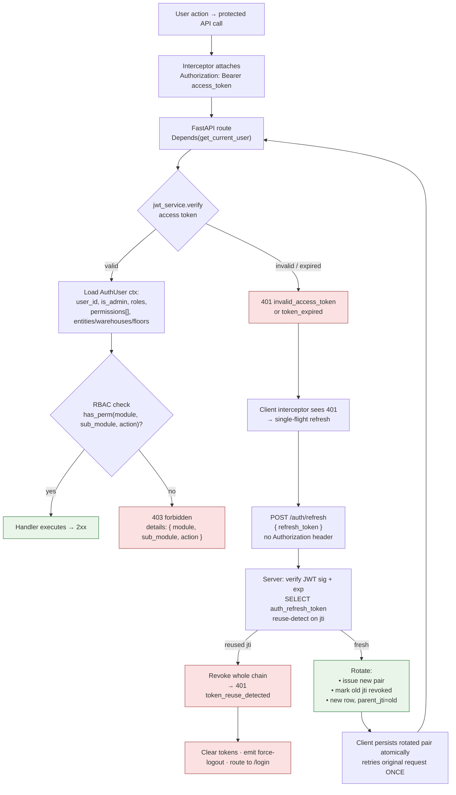
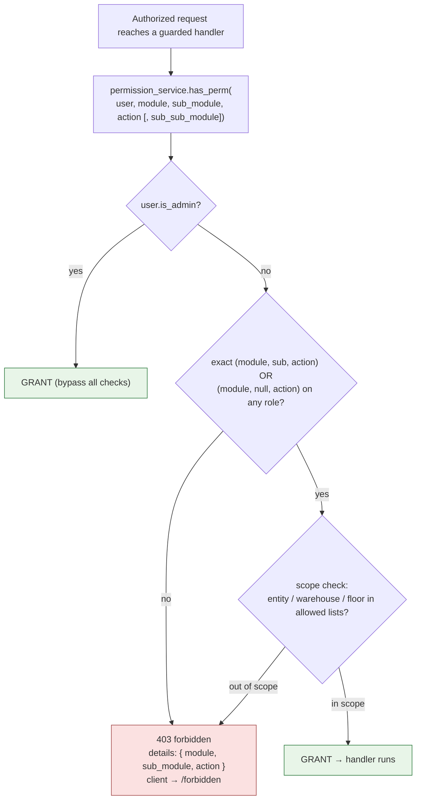

# Authentication & Authorization — Flow & Frontend Payload Reference

Detailed flow diagrams and frontend payload reference for the Candor Consumption FastAPI backend.

| Field | Value |
|---|---|
| Base URL (prod) | `https://desktop-backend-vhf0.onrender.com` |
| Base URL (local) | `http://localhost:8000` |
| Auth prefix | `/api/v1/auth` |
| Header after login | `Authorization: Bearer <access_token>` |
| Algorithm | JWT `HS256`, issuer `candor-consumption` |
| Access TTL | `900` s (15 min) — read `expires_in` from response, never hardcode |
| Refresh TTL | `28800` s (8 h) — read `refresh_expires_in` from response |

Source of truth: [modules/auth/router.py](../modules/auth/router.py) · [modules/auth/schemas.py](../modules/auth/schemas.py) · [Plan/Frontend/1_Authentication_and_Authorization.md](../Plan/Frontend/1_Authentication_and_Authorization.md)

---

## 1. End-to-end architecture

Two clients (Electron desktop, native Android) speak to the same FastAPI auth router. Every response carries an error envelope, `X-Request-ID`, `Cache-Control: no-store`, and `X-Content-Type-Options: nosniff`. The `get_current_user` dependency validates the bearer token, then the service layer talks to Postgres via an asyncpg pool.



---

## 2. Hard rules (frontend MUST follow)

| # | Rule |
|---|---|
| 1 | Never persist tokens in plain storage. Electron: `safeStorage.encryptString`; Android: `EncryptedSharedPreferences` + `MasterKey.AES256_GCM`. |
| 2 | Send `refresh_token` ONLY on `/auth/refresh` and `/auth/logout`. Access token on every other call. |
| 3 | Never log tokens. Mask as `Bearer ****` and strip from crash reports. |
| 4 | Treat JWT as opaque. May decode `exp` to schedule a proactive refresh — never to make security decisions. |
| 5 | `permissions[]` from `/me` is a UX hint only. Server is authoritative on every call. |
| 6 | Capture `X-Request-ID` (or `details.request_id`) and surface it in every user-facing error toast. |
| 7 | Phone: send raw user input (4 accepted formats). Server normalizes to E.164. |
| 8 | `/refresh` rotates BOTH tokens. Replace both atomically; reusing an old refresh revokes the whole chain. |
| 9 | After `/password/change`, other devices are revoked. Show `"Other devices signed out (N)"` toast. |
| 10 | `423 account_locked` and `429 rate_limit_exceeded` are user-recoverable. Show timer; do NOT auto-retry. |
| 11 | Concurrent 401s → exactly ONE `/refresh`; queue others on the result (single-flight). |
| 12 | `token_reuse_detected`, `invalid_refresh_token`, `account_disabled/suspended`, `/refresh` 401 → clear + login. |

---

## 3. Login flow — `POST /api/v1/auth/login`

Public endpoint. Rate-limited per `(ip, phone)`. The failed-password `UPDATE` runs in autocommit — do **not** wrap in a transaction, that would roll the counter back and disable lockout.



---

## 4. Protected request + transparent refresh

On every protected route, FastAPI's `Depends(get_current_user)` verifies the JWT and loads the `AuthUser` context. A 401 from a normal call triggers the client's **single-flight** refresh: exactly one `/auth/refresh` runs and queued requests wait on its result. The original request retries **once**; another 401 forces re-login. Refresh-token rotation is mandatory — reusing an old `jti` revokes the entire chain.



---

## 5. Authorization (RBAC) decision tree

Admins (`is_admin=TRUE` on either the user or any of their roles) bypass all permission checks. For non-admins the server looks for an exact `(module, sub_module, action)` grant or a broader `(module, null, action)` grant on any of the user's roles, then applies the scope filter (`allowed_entities` / `allowed_warehouses` / `allowed_floors`). Frontend `can()` is a UX hint only — every API call is independently authorized.



---

## 6. Logout, logout-all, change-password, admin reset

```mermaid
flowchart TD
    subgraph Logout["Logout"]
        LO1["POST /auth/logout<br/>{ refresh_token } + Authorization Bearer"]
        LO2["auth_service.logout(conn, refresh_jwt, user_id)<br/>revoke only if jti belongs to user (silent)<br/>idempotent — always 204"]
        LO3["Client clears local tokens"]
        LO1 --> LO2 --> LO3
    end

    subgraph LogoutAll["Logout-all"]
        LA1["POST /auth/logout-all (Bearer)"]
        LA2["UPDATE auth_refresh_token<br/>SET revoked_at=NOW()<br/>WHERE user_id=$1 AND revoked_at IS NULL"]
        LA3["200 { revoked_count: N }<br/>Client clears tokens · routes to /login"]
        LA1 --> LA2 --> LA3
    end

    subgraph PwdChange["Change password (self)"]
        PC1["POST /auth/password/change (Bearer)<br/>{ old_password, new_password, confirm_password }"]
        PC2["verify_password(old)<br/>→ 401 invalid_old_password on mismatch"]
        PC3["password_rules.evaluate(new, phone)<br/>→ 400 weak_password<br/>details.rules: ['length_12_128', ...]"]
        PC4["if new != confirm → 400 password_mismatch<br/>UPDATE password_hash, password_changed_at,<br/>must_change_password=FALSE"]
        PC5["Revoke every OTHER refresh token for user<br/>(keep current jti alive)<br/>revoke_reason='password_changed'"]
        PC6["200 { message, revoked_count }<br/>Client toast: 'Other devices signed out (N)'"]
        PC1 --> PC2 --> PC3 --> PC4 --> PC5 --> PC6
    end

    subgraph AdminReset["Admin reset"]
        AD1["POST /auth/users/{id}/reset-password (Bearer admin)<br/>{ new_password }<br/>→ forces must_change_password=TRUE on target<br/>→ revokes ALL target's refresh tokens<br/>→ clears lockout · same password policy"]
    end
```



---

## 7. Expected frontend payloads — endpoint by endpoint

Field types reflect [modules/auth/schemas.py](../modules/auth/schemas.py). `min_length=1` on every string field — validate non-empty client-side before submit to avoid 422 round-trips.

### 7.1 `POST /api/v1/auth/login` — *(no auth header)*

```jsonc
{
  "phone": "9876543210",                          // required; raw user input; server normalizes
  "password": "MyPass1234!",                      // required; plain text over HTTPS
  "device_info": {                                // OPTIONAL but recommended (free-form, persisted)
    "device_id":   "stable-uuid-per-install",     // stable across launches
    "device_name": "Kaushal's Pixel 8",           // user-readable label for /sessions
    "app_version": "1.1.0",
    "platform":    "android"                      // "android" | "ios" | "electron" | "web"
  }
}
```

- Do **not** send `Authorization` on login.
- `phone` accepts `9876543210`, `09876543210`, `+919876543210`, `919876543210` — all normalize to `+919876543210`.
- `device_info` may carry extra fields — server is forward-compatible (`extra=allow`).

### 7.2 `POST /api/v1/auth/refresh` — *(no auth header)*

```jsonc
{
  "refresh_token": "<current refresh JWT>"        // required
}
```

Do not send `Authorization`. On 200, persist **both** rotated tokens atomically.

### 7.3 `POST /api/v1/auth/logout` — *(Bearer required)*

```jsonc
{
  "refresh_token": "<current refresh JWT>"        // required — the session to kill
}
```

Idempotent: silently `204`s even for a stolen / cross-user / already-revoked token. Always clear local tokens after calling, regardless of HTTP status.

### 7.4 `POST /api/v1/auth/logout-all` — *(Bearer required)*

No request body. Response: `{ "revoked_count": N }`. After this call, every refresh token (including the current one) is dead — clear local tokens and route to `/login`.

### 7.5 `GET /api/v1/auth/me` — *(Bearer required)*

No request body. No query params. Headers: `Authorization: Bearer <access_token>`.

### 7.6 `POST /api/v1/auth/password/change` — *(Bearer required)*

```jsonc
{
  "old_password":     "OldPass1234",              // required
  "new_password":     "NewStrongPass5678",        // required, must satisfy §6.1 rules
  "confirm_password": "NewStrongPass5678"         // required, must == new_password
}
```

Server validates:

| Rule key | Constraint |
|---|---|
| `length_12_128` | 12 ≤ length ≤ 128 |
| `alpha_and_digit` | ≥ 1 letter AND ≥ 1 digit |
| `not_equals_or_contains_phone` | Must not equal nor contain user's phone (any 7+ digit suffix) |
| `not_in_common_blocklist` | Not in `common_passwords.txt` (case-insensitive) |

Pre-validate the first three rules client-side for snappy UX; let the server return `400 weak_password` with `details.rules` for the blocklist check.

### 7.7 `GET /api/v1/auth/sessions` — *(Bearer required)*

No body. Returns the user's live refresh sessions with `is_current` on the active one.

### 7.8 `DELETE /api/v1/auth/sessions/{token_id}` — *(Bearer required)*

Path param: `token_id` from `/sessions`. No body. `204` on success, `404 session_not_found` if it doesn't exist **or** belongs to another user (no leak). Revoking your own current session signs you out.

---

## 8. Admin-only endpoint payloads — *(Bearer + `is_admin`)*

### 8.1 `POST /api/v1/auth/users` — create user

```jsonc
{
  "phone":              "9876543211",             // required, accepts the same 4 formats
  "password":           "TempPass1234",           // required, same policy as /password/change
  "full_name":          "Ramesh Kumar",           // required
  "role_id":            4,                        // required, must exist in auth_role
  "email":              "ramesh@candorfoods.in",  // optional, nullable
  "entity":             "cfpl",                   // optional: "cfpl" | "cdpl" | null
  "allowed_warehouses": ["W202"]                  // optional, array of warehouse codes
}
```

`409` on duplicate phone (constraint `phone`). `400 weak_password` with `details.rules` if the temp password fails policy.

### 8.2 `PUT /api/v1/auth/users/{user_id}` — partial edit

```jsonc
{                                                  // every key OPTIONAL — only send what changes
  "full_name":          "Ramesh K.",
  "email":              "ramesh.k@candorfoods.in",
  "role_id":            2,
  "entity":             "cfpl",
  "is_active":          false,                    // soft-delete via DELETE is preferred
  "allowed_warehouses": ["W202","W301"]
}
```

Server allowlists fields: `full_name, email, role_id, entity, is_active, allowed_warehouses`. Anything else is silently dropped — sending `password_encrypted`, `is_admin`, etc. is a no-op.

### 8.3 `DELETE /api/v1/auth/users/{user_id}` — deactivate

No body. Sets `is_active=FALSE` and revokes all the target's live refresh tokens with `revoke_reason='admin_revoked'`.

### 8.4 `POST /api/v1/auth/users/{user_id}/reset-password`

```jsonc
{
  "new_password": "TempStrongPass1234"            // required, 1–256 chars, same policy
}
```

Forces `must_change_password=TRUE` on the target, clears any lockout, and revokes all the target's live refresh tokens. Response: `{ user_id, message, revoked_count, temp_password_set: true }`.

### 8.5 `POST /api/v1/auth/roles` — create role

```jsonc
{
  "role_name":   "qc_lead",                       // required, unique
  "description": "QC team lead",                  // optional, default ""
  "is_admin":    false                            // optional, default false
}
```

### 8.6 `PUT /api/v1/auth/roles/{role_id}/permissions` — replace all

```jsonc
{
  "permission_ids":     [1, 2, 5, 10, 24, 25],    // required; replaces every existing mapping
  "allowed_entities":   ["cfpl"],                 // optional, null = all entities
  "allowed_warehouses": ["W202"],                 // optional, null = all warehouses
  "allowed_floors":     ["1st Floor"]             // optional, null = all floors
}
```

### 8.7 `POST /api/v1/auth/permissions/create`

```jsonc
{
  "module":         "production",                 // required
  "sub_module":     "plans",                      // optional, nullable
  "sub_sub_module": "approve",                    // optional, nullable
  "action":         "create",                     // required
  "description":    "Approve a production plan"   // optional, default ""
}
```

### 8.8 `PUT /api/v1/auth/permissions/{permission_id}`

Partial edit; allowlist = `module, sub_module, sub_sub_module, action, description`. Any other key is silently dropped.

### 8.9 `POST /api/v1/auth/modules` — bulk create permissions

```jsonc
{
  "module":      "quality",                       // required
  "sub_modules": ["inspections", "calibration"]   // optional; null = create module-level only
}
// Auto-creates view / create / edit / delete for each (module, sub_module).
// Returns: { module, sub_modules, permissions_created: N }
```

---

## 9. Error envelope & codes

Every non-2xx response has this shape. The `X-Request-ID` response header always carries the same UUID as `request_id`. Surface the request_id in every user-facing error toast — support uses it to grep backend logs.

```jsonc
{
  "error":      "<machine_code>",                 // stable; switch on this in code
  "message":    "<human_readable>",               // safe to show to users
  "request_id": "<uuid>",                         // = response header X-Request-ID
  "timestamp":  "2026-05-07T10:23:45.123Z",       // ISO-8601 UTC
  "details":    { }                               // shape varies by error (see table)
}
```

| HTTP | `error` | `details` | Frontend behaviour |
|---|---|---|---|
| 400 | `weak_password` | `rules: string[]` | Render rule keys inline; highlight new-password field |
| 400 | `password_mismatch` | — | Highlight confirm field |
| 401 | `invalid_credentials` | — | Generic message; do NOT distinguish unknown-phone vs wrong-password |
| 401 | `invalid_access_token` | — | Trigger refresh-and-retry once; on failure → re-login |
| 401 | `invalid_refresh_token` | — | Clear tokens, route to login |
| 401 | `token_expired` | — | From `/refresh` → clear + login. From normal call → impossible (interceptor) |
| 401 | `token_reuse_detected` | — | Clear tokens, route to login, `"Security alert: please sign in again."` |
| 401 | `invalid_old_password` | — | Highlight Old Password field |
| 403 | `account_suspended` | — | `"Your account is suspended. Contact your admin."` |
| 403 | `account_disabled` | — | `"Your account is disabled."` |
| 403 | `forbidden` | `module, sub_module, action` | Redirect to `/forbidden`; show which permission was missing |
| 404 | `session_not_found` | — | On Sessions screen: `"Session no longer exists — refreshing list"` |
| 404 | `user_not_found` | — | (Admin reset-password) `"User not found"` |
| 409 | varies | — | Show `message` (e.g. `"Phone number already registered"`) |
| 422 | `validation_error` | `errors[]` | FastAPI body validation — show first error inline |
| 423 | `account_locked` | `locked_until, failed_login_count` | Disable submit; countdown to `locked_until` |
| 429 | `rate_limit_exceeded` | `retry_after_seconds, limit, window_seconds` | Disable submit; honour `Retry-After` header |
| 500 | `internal_error` | — | Generic + show `request_id` from envelope |

---

## 10. Response payload quick reference

### 10.1 `LoginResponse` / `RefreshResponse`

```jsonc
{
  "access_token":        "eyJhbGciOiJIUzI1NiIsInR5cCI6IkpXVCJ9...",
  "refresh_token":       "eyJhbGciOiJIUzI1NiIsInR5cCI6IkpXVCJ9...",
  "token_type":          "Bearer",
  "expires_in":          900,                     // access TTL, seconds
  "refresh_expires_in":  28800,                   // refresh TTL, seconds
  "must_change_password": false,                  // login response only — gates navigation
  "user": {                                       // login response only
    "user_id":   "1",
    "phone":     "+919876543210",                 // normalized E.164
    "full_name": "Kaushal Patel",
    "email":     "kaushal@candorfoods.in",
    "is_admin":  true,
    "roles": [
      { "role_id": "1", "code": "admin",
        "label": "Full unrestricted access", "is_admin": true }
    ]
  }
}
```

### 10.2 `MeResponse`

```jsonc
{
  "user_id":              "1",
  "phone":                "+919876543210",
  "full_name":            "Kaushal Patel",
  "email":                "kaushal@candorfoods.in",
  "status":               "active",               // "active" | "suspended" | "disabled"
  "must_change_password": false,
  "is_admin":             true,
  "roles":                [ { "role_id": "1", "code": "admin", "label": "...", "is_admin": true } ],
  "permissions": [                                // UX-hint only; server is authoritative
    { "module": "production", "sub_module": "plans",     "action": "view" },
    { "module": "production", "sub_module": "job_cards", "action": "view" }
  ],
  "entities":             ["cfpl"],               // user-level scope defaults
  "warehouses":           ["W202"],
  "floors":               [],
  "last_login_at":        "2026-05-07T10:00:00Z",
  "password_changed_at":  "2026-04-30T08:30:00Z"
}
```

### 10.3 `SessionsResponse` (one row)

```jsonc
{
  "token_id":    "f81d4fae-7dec-11d0-a765-00a0c91e6bf6",
  "token_type":  "refresh",
  "issued_at":   "2026-05-07T08:00:00Z",
  "expires_at":  "2026-05-07T16:00:00Z",
  "ip":          "203.0.113.42",
  "user_agent":  "Mozilla/5.0 ...",
  "device_info": {                                // whatever the client sent on /login
    "device_id":   "stable-uuid",
    "device_name": "Kaushal's Pixel 8",
    "platform":    "android"
  },
  "is_current":  true                             // matches current refresh jti
}
```

---

## 11. Database tables referenced

Schema source: [db/auth_schema.sql](../db/auth_schema.sql) (base) + [db/004_auth_rebuild.sql](../db/004_auth_rebuild.sql) (lockout / status / JWT refresh-token store).

### 11.1 Tables, columns, and what each one is for

| Table | Purpose | Key columns |
|---|---|---|
| `auth_user` | One row per user. Identity, credentials, lockout, scope defaults. | `user_id` PK · `phone` UNIQUE · `password_encrypted` (bcrypt hash, despite the column name) · `full_name` · `email` · `role_id` FK→`auth_role` · `entity` · `allowed_warehouses TEXT[]` · `is_active` · `status` CHECK in (`'active'`,`'suspended'`,`'disabled'`) · `failed_login_count` · `locked_until` · `must_change_password` · `password_changed_at` · `created_at` · `last_login_at` |
| `auth_role` | Catalog of roles. `is_admin=TRUE` bypasses every permission check. | `role_id` PK · `role_name` UNIQUE · `description` · `is_admin` · `created_at` |
| `auth_permission` | Catalog of granular `(module, sub_module, sub_sub_module, action)` permissions. | `permission_id` PK · `module` · `sub_module` (nullable) · `sub_sub_module` (nullable) · `action` · `description` · UNIQUE`(module, sub_module, sub_sub_module, action)` |
| `auth_role_permission` | Many-to-many bridge: which permissions each role has, plus scope filters. | `role_id` FK ON DELETE CASCADE · `permission_id` FK ON DELETE CASCADE · `allowed_entities TEXT[]` · `allowed_warehouses TEXT[]` · `allowed_floors TEXT[]` · PK`(role_id, permission_id)` |
| `auth_refresh_token` | Canonical refresh-token store (introduced by migration 004). One row per refresh token ever issued. Drives reuse-detection, rotation chains, and the `/sessions` UI. | `jti` UUID PK · `user_id` FK ON DELETE CASCADE · `parent_jti` (NULL for login-issued) · `chain_root` UUID (root of the rotation chain) · `issued_at` · `expires_at` · `rotated_at` · `revoked_at` · `revoke_reason` (`logout`/`logout_all`/`reuse`/`password_change`/`admin_revoked`) · `ip` · `user_agent` · `device_info JSONB` |
| `auth_active_sessions` *(view)* | Read-only view over `auth_refresh_token` filtered to live rows (`revoked_at IS NULL AND rotated_at IS NULL AND expires_at > NOW()`). Backs `GET /sessions`. | `token_id` (= `jti`) · `user_id` · `issued_at` · `expires_at` · `ip` · `user_agent` · `device_info` · `chain_root` |
| `auth_session` *(legacy, deprecated)* | Pre-JWT session table. **Not** written or read by the JWT flow — kept only until a future migration drops it. | — |

### 11.2 Indexes

| Index | Table | Purpose |
|---|---|---|
| `auth_user_phone_key` (UNIQUE) | `auth_user(phone)` | Enforces phone uniqueness; backs the login lookup |
| `idx_auth_user_phone` | `auth_user(phone)` | Login lookup path |
| `auth_user_status_check` (CHECK) | `auth_user(status)` | Constrains `status` to the 3 allowed values |
| `idx_refresh_user` | `auth_refresh_token(user_id)` | `/sessions` + `/logout-all` scans |
| `idx_refresh_chain_root` | `auth_refresh_token(chain_root)` | Whole-chain revocation on reuse-detect |
| `idx_refresh_active` *(partial)* | `auth_refresh_token(user_id) WHERE revoked_at IS NULL AND rotated_at IS NULL` | Fast active-session lookup |
| `auth_permission` UNIQUE | `(module, sub_module, sub_sub_module, action)` | Permission catalog dedup |

### 11.3 Which endpoint touches which table

| Endpoint | Tables read | Tables written |
|---|---|---|
| `POST /auth/login` | `auth_user` (by phone), `auth_role` (join for `is_admin`) | `auth_user` (UPDATE `failed_login_count`, `locked_until`, `last_login_at`) · `auth_refresh_token` (INSERT root row, `parent_jti=NULL`, `chain_root=jti`) |
| `POST /auth/refresh` | `auth_refresh_token` (by `jti`, with reuse-detect) | `auth_refresh_token` (UPDATE old row `rotated_at` + INSERT new row with `parent_jti=old`, `chain_root` inherited; on reuse → UPDATE every row WHERE `chain_root=X` SET `revoked_at`,`revoke_reason='reuse'`) |
| `POST /auth/logout` | `auth_refresh_token` (verify `jti` belongs to caller) | `auth_refresh_token` (UPDATE `revoked_at`, `revoke_reason='logout'`) |
| `POST /auth/logout-all` | `auth_refresh_token` (caller's live rows) | `auth_refresh_token` (UPDATE all live rows for user, `revoke_reason='logout_all'`) |
| `GET /auth/me` | `auth_user`, `auth_role`, `auth_role_permission`, `auth_permission` | — |
| `POST /auth/password/change` | `auth_user` (verify old bcrypt) | `auth_user` (UPDATE `password_encrypted`, `password_changed_at`, `must_change_password=FALSE`) · `auth_refresh_token` (UPDATE every OTHER row, `revoke_reason='password_change'`) |
| `GET /auth/sessions` | `auth_active_sessions` view (or `auth_refresh_token` directly) | — |
| `DELETE /auth/sessions/{token_id}` | `auth_refresh_token` (verify `jti` belongs to caller) | `auth_refresh_token` (UPDATE `revoked_at`, `revoke_reason='logout'`) |
| `POST /auth/users` *(admin)* | `auth_role` (verify `role_id`) | `auth_user` (INSERT) |
| `GET /auth/users` *(admin)* | `auth_user LEFT JOIN auth_role` | — |
| `PUT /auth/users/{id}` *(admin)* | — | `auth_user` (UPDATE allowlisted columns only) |
| `DELETE /auth/users/{id}` *(admin)* | — | `auth_user` (UPDATE `is_active=FALSE`) · `auth_refresh_token` (UPDATE all live, `revoke_reason='admin_revoked'`) |
| `POST /auth/users/{id}/reset-password` *(admin)* | — | `auth_user` (UPDATE `password_encrypted`, `must_change_password=TRUE`, clear `locked_until`/`failed_login_count`) · `auth_refresh_token` (UPDATE all live, `revoke_reason='admin_revoked'`) |
| `GET /auth/roles` *(admin)* | `auth_role LEFT JOIN auth_role_permission` | — |
| `POST /auth/roles` *(admin)* | — | `auth_role` (INSERT) |
| `GET /auth/roles/{id}/permissions` *(admin)* | `auth_role`, `auth_role_permission`, `auth_permission` | — |
| `PUT /auth/roles/{id}/permissions` *(admin)* | — | `auth_role_permission` (DELETE all for role + INSERT new set, atomic) |
| `GET /auth/permissions` *(admin)* | `auth_permission` | — |
| `GET /auth/permissions/hierarchy` *(admin)* | `auth_permission` | — |
| `POST /auth/permissions/create` *(admin)* | — | `auth_permission` (INSERT) |
| `PUT /auth/permissions/{id}` *(admin)* | — | `auth_permission` (UPDATE allowlisted columns only) |
| `DELETE /auth/permissions/{id}` *(admin)* | — | `auth_role_permission` (DELETE WHERE permission_id) · `auth_permission` (DELETE) |
| `GET /auth/modules` *(admin)* | `auth_permission` (aggregated) | — |
| `POST /auth/modules` *(admin)* | — | `auth_permission` (INSERT view/create/edit/delete per sub_module, ON CONFLICT DO NOTHING) |

### 11.4 Entity-relationship sketch

```mermaid
erDiagram
    auth_user ||--o{ auth_refresh_token : "issues"
    auth_user }o--|| auth_role : "has"
    auth_role ||--o{ auth_role_permission : "grants"
    auth_permission ||--o{ auth_role_permission : "granted via"
    auth_refresh_token ||--o{ auth_refresh_token : "rotates (parent_jti)"

    auth_user {
        SERIAL  user_id PK
        TEXT    phone UNIQUE
        TEXT    password_encrypted "bcrypt hash"
        TEXT    full_name
        TEXT    email
        INT     role_id FK
        TEXT    entity
        TEXT_ARR allowed_warehouses
        BOOL    is_active
        TEXT    status "active|suspended|disabled"
        INT     failed_login_count
        TSTZ    locked_until
        BOOL    must_change_password
        TSTZ    password_changed_at
        TSTZ    created_at
        TSTZ    last_login_at
    }
    auth_role {
        SERIAL  role_id PK
        TEXT    role_name UNIQUE
        TEXT    description
        BOOL    is_admin "bypass all checks"
        TSTZ    created_at
    }
    auth_permission {
        SERIAL  permission_id PK
        TEXT    module
        TEXT    sub_module "nullable"
        TEXT    sub_sub_module "nullable"
        TEXT    action
        TEXT    description
    }
    auth_role_permission {
        INT       role_id PK_FK
        INT       permission_id PK_FK
        TEXT_ARR  allowed_entities "null = all"
        TEXT_ARR  allowed_warehouses "null = all"
        TEXT_ARR  allowed_floors "null = all"
    }
    auth_refresh_token {
        UUID    jti PK
        INT     user_id FK
        UUID    parent_jti "null if login-issued"
        UUID    chain_root "for chain-wide revoke"
        TSTZ    issued_at
        TSTZ    expires_at
        TSTZ    rotated_at
        TSTZ    revoked_at
        TEXT    revoke_reason
        TEXT    ip
        TEXT    user_agent
        JSONB   device_info
    }
```

### 11.5 Seeded data (defaults)

- **Roles** (`auth_role`): `admin` *(is_admin=TRUE)*, `planner`, `inventory_manager`, `team_leader`, `qc_inspector`, `floor_manager`, `purchase_manager`, `viewer`.
- **Default admin user** (`auth_user`): phone `9004464207`, password `Candor@123*` *(change immediately in any non-dev environment)*.
- **Permissions** (`auth_permission`): ~60 rows across `production` (14 sub_modules), `purchase`, `so`, and `auth` (admin-only `users` + `roles`).
- **Role-permission mappings** (`auth_role_permission`): admin gets every permission; viewer gets every `action='view'` permission; the other roles get curated subsets — see `db/auth_schema.sql` §§207-284 for the exact `SELECT … WHERE …` rules.

---

## 12. Source pointers

| Concern | File |
|---|---|
| Endpoints + wire shapes | [modules/auth/router.py](../modules/auth/router.py) · [modules/auth/schemas.py](../modules/auth/schemas.py) |
| Login / refresh / rotation | [modules/auth/services/auth_service.py](../modules/auth/services/auth_service.py) |
| JWT issuance + verification | [modules/auth/services/jwt_service.py](../modules/auth/services/jwt_service.py) |
| Permission engine | [modules/auth/services/permission_service.py](../modules/auth/services/permission_service.py) |
| Password rules | [modules/auth/services/password_rules.py](../modules/auth/services/password_rules.py) |
| Phone normalization | [modules/auth/services/phone.py](../modules/auth/services/phone.py) |
| Rate limiter | [modules/auth/services/rate_limiter.py](../modules/auth/services/rate_limiter.py) |
| RBAC middleware | [modules/auth/middleware.py](../modules/auth/middleware.py) |
| Error envelope middleware | [core/middleware/request_context.py](../core/middleware/request_context.py) |
| DB schema | [db/auth_schema.sql](../db/auth_schema.sql) |
| Token TTL / lockout settings | [app/config.py](../app/config.py) (`Settings.ACCESS_TOKEN_TTL_SECONDS`, …) |
