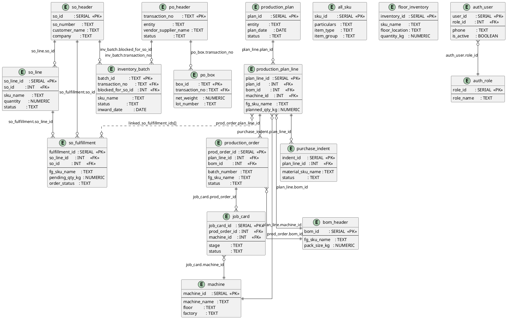

# Database Overview — All Modules

High-level cross-module entity relationship diagram showing how all major tables connect.

## File Index

| File | Module | Key Tables |
|------|--------|-----------|
| [01_so_creation.md](01_so_creation.md) | Sales Order creation | so_header, so_line, all_sku, so_gst_reconciliation |
| [02_so_fulfillment.md](02_so_fulfillment.md) | SO fulfillment tracking | so_fulfillment, so_revision_log |
| [03_planning.md](03_planning.md) | Production plan & dashboard | production_plan, production_plan_line |
| [04_bom_master.md](04_bom_master.md) | Bill of Materials | bom_header, bom_line, bom_process_route |
| [05_machines_floors.md](05_machines_floors.md) | Machines & capacity | machine, machine_capacity |
| [06_production_orders.md](06_production_orders.md) | Production orders | production_order |
| [07_job_cards.md](07_job_cards.md) | Job cards & annexures | job_card + 10 annexure tables |
| [08_inventory_store.md](08_inventory_store.md) | Floor inventory & store | floor_inventory, floor_movement, offgrade_*, purchase_indent |
| [09_purchase_orders.md](09_purchase_orders.md) | Purchase orders | po_header, po_line, po_section, po_box |
| [10_ims_module.md](10_ims_module.md) | Internal Material System | production_indent, issue_note, lot_block, qc_inspection, rtv_disposition |
| [11_auth.md](11_auth.md) | Auth & access control | auth_role, auth_user, auth_permission, auth_session |
| [12_analytics.md](12_analytics.md) | Analytics & day-end | process_loss, yield_summary, day_end_balance_scan, discrepancy_report |
| [13_inventory_ledger.md](13_inventory_ledger.md) | Inventory batch ledger | inventory_batch, inventory_event_log, batch_block_history |
