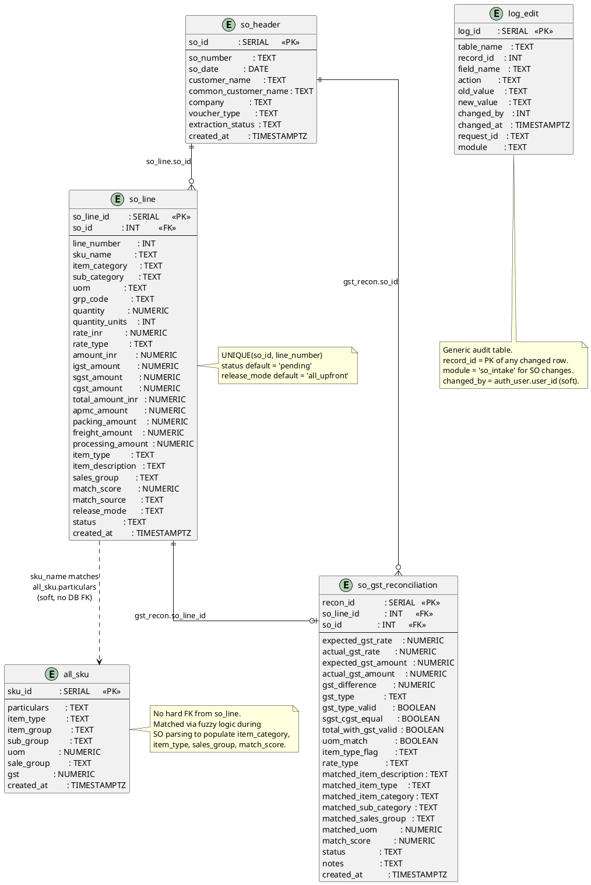

# Sales Order (SO) Creation

Tables involved in uploading, parsing, and managing sales orders.



## Field Relations Summary

| Field | Table | Points To | Purpose |
|-------|-------|-----------|---------|
| `so_line.so_id` | so_line | `so_header.so_id` | Links each line item to its parent SO |
| `so_gst_reconciliation.so_line_id` | so_gst_reconciliation | `so_line.so_line_id` | One recon record per SO line |
| `so_gst_reconciliation.so_id` | so_gst_reconciliation | `so_header.so_id` | Direct SO header shortcut |
| `so_line.sku_name` | so_line | `all_sku.particulars` | Soft match — fuzzy-matched during SO parsing |
| `log_edit.record_id` | log_edit | Any table PK | Generic audit trail |
| `log_edit.changed_by` | log_edit | `auth_user.user_id` | Who made the change (soft ref) |

## Status Flow

```
so_header.extraction_status : pending → extracted → failed
so_line.status              : pending → approved → rejected
so_gst_reconciliation.status: ok | warning | error
```
