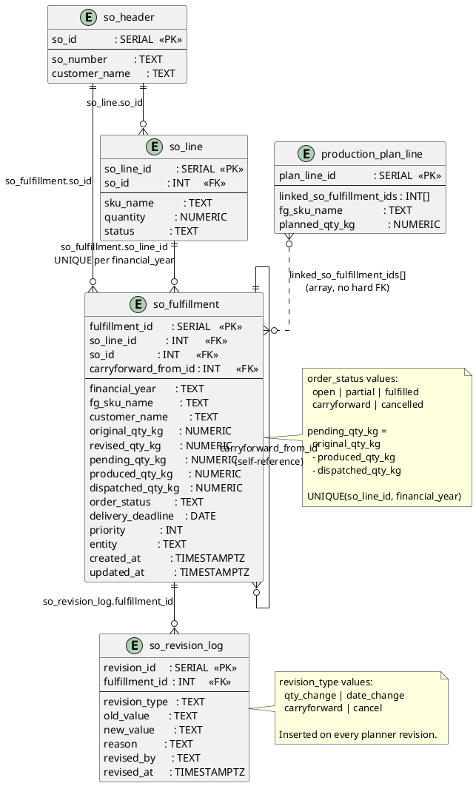

# SO Fulfillment

Bridges the SO module to production planning. Tracks how much of each SO line has been produced and dispatched.



## Field Relations Summary

| Field | Table | Points To | Purpose |
|-------|-------|-----------|---------|
| `so_fulfillment.so_line_id` | so_fulfillment | `so_line.so_line_id` | Which SO line this fulfillment tracks |
| `so_fulfillment.so_id` | so_fulfillment | `so_header.so_id` | Shortcut to parent SO header |
| `so_fulfillment.carryforward_from_id` | so_fulfillment | `so_fulfillment.fulfillment_id` | Self-ref: which previous record was carried forward |
| `so_revision_log.fulfillment_id` | so_revision_log | `so_fulfillment.fulfillment_id` | Revision belongs to one fulfillment row |
| `production_plan_line.linked_so_fulfillment_ids` | production_plan_line | `so_fulfillment.fulfillment_id[]` | Open orders this plan line addresses |

## Status Flow

```
open → partial → fulfilled
     ↘ carryforward  (new row created for next financial year)
     ↘ cancelled
```
