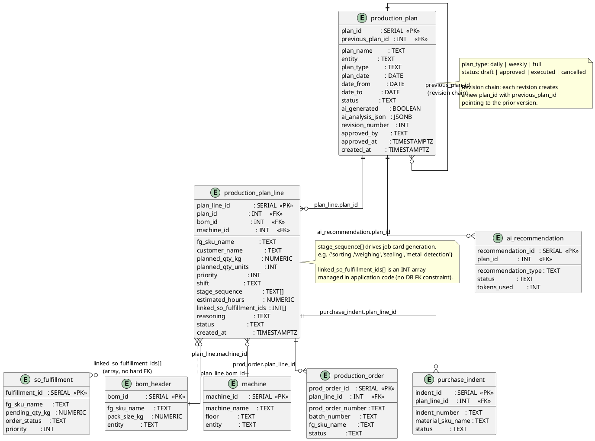

# Production Planning & Plan Dashboard

Plan header, plan lines, and their connections to fulfillment, BOM, and machines.



## Field Relations Summary

| Field | Table | Points To | Purpose |
|-------|-------|-----------|---------|
| `production_plan_line.plan_id` | production_plan_line | `production_plan.plan_id` | Which plan this line belongs to |
| `production_plan_line.bom_id` | production_plan_line | `bom_header.bom_id` | BOM for this product |
| `production_plan_line.machine_id` | production_plan_line | `machine.machine_id` | Machine assigned for this run |
| `production_plan_line.linked_so_fulfillment_ids` | production_plan_line | `so_fulfillment.fulfillment_id[]` | Open orders this plan line addresses |
| `production_plan.previous_plan_id` | production_plan | `production_plan.plan_id` | Self-ref: prior revision of this plan |
| `production_order.plan_line_id` | production_order | `production_plan_line.plan_line_id` | Which plan line spawned this order |
| `purchase_indent.plan_line_id` | purchase_indent | `production_plan_line.plan_line_id` | Indent raised for material shortage |
| `ai_recommendation.plan_id` | ai_recommendation | `production_plan.plan_id` | Claude suggestion linked to a plan |

## Plan Status Flow

```
draft → approved → executed
      ↘ cancelled

Revision: approved → new draft (previous_plan_id set) → approved
```
