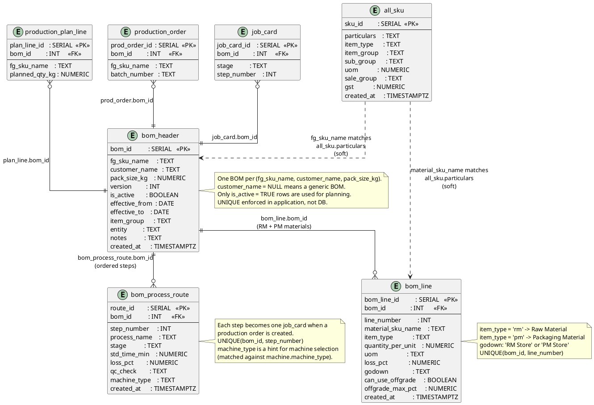

# BOM & Master Data

Bill of Materials: header, line items (raw material + packaging), and process route (manufacturing steps).



## Field Relations Summary

| Field | Table | Points To | Purpose |
|-------|-------|-----------|---------|
| `bom_line.bom_id` | bom_line | `bom_header.bom_id` | Line belongs to this BOM |
| `bom_process_route.bom_id` | bom_process_route | `bom_header.bom_id` | Route step belongs to this BOM |
| `bom_header.fg_sku_name` | bom_header | `all_sku.particulars` | Soft match — the finished good name |
| `bom_line.material_sku_name` | bom_line | `all_sku.particulars` | Soft match — RM/PM ingredient name |
| `production_plan_line.bom_id` | production_plan_line | `bom_header.bom_id` | BOM used in planning |
| `production_order.bom_id` | production_order | `bom_header.bom_id` | BOM locked at order creation |
| `job_card.bom_id` | job_card | `bom_header.bom_id` | BOM referenced during execution |

## BOM Lookup Priority

```
1. Look for BOM matching (fg_sku_name, customer_name, pack_size_kg) → customer-specific
2. Fall back to (fg_sku_name, NULL, pack_size_kg)                   → generic BOM
```
