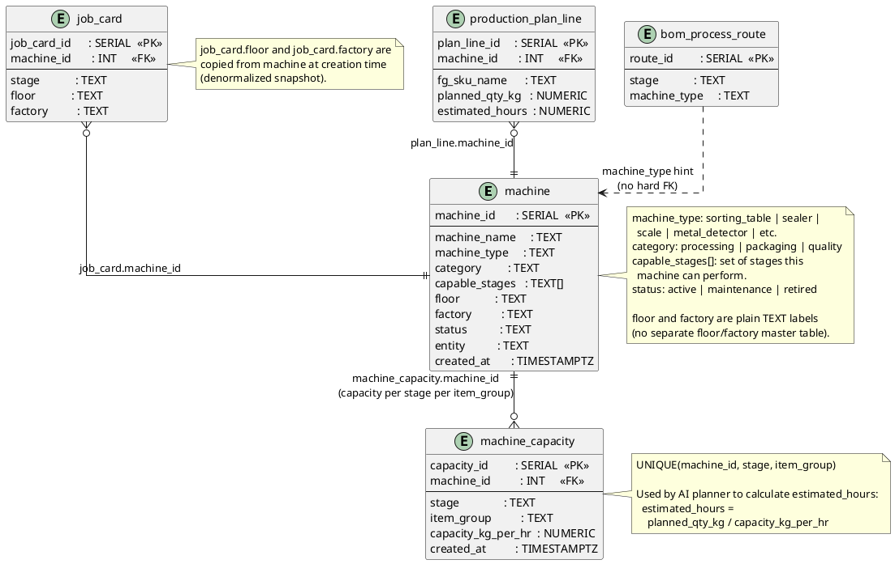

# Machines & Floors

Machine master data and per-machine capacity per product group per stage.



## Field Relations Summary

| Field | Table | Points To | Purpose |
|-------|-------|-----------|---------|
| `machine_capacity.machine_id` | machine_capacity | `machine.machine_id` | Capacity row belongs to this machine |
| `production_plan_line.machine_id` | production_plan_line | `machine.machine_id` | Machine assigned at planning time |
| `job_card.machine_id` | job_card | `machine.machine_id` | Physical machine running this job card |
| `bom_process_route.machine_type` | bom_process_route | — | Text hint; code queries `machine` by type |

## Floors

Floors are **not a separate table**. They exist as the `floor` TEXT column on `machine` and `job_card`. The GET `/floors` API derives the virtual floor list from distinct `machine.floor` values and joins active job card counts.

## Capacity Formula

```
item_group = bom_header.item_group        (e.g. 'cashew')
stage      = bom_process_route.stage      (e.g. 'weighing')

capacity = machine_capacity WHERE
             machine_id = plan_line.machine_id
             AND stage      = stage
             AND item_group = item_group

estimated_hours = planned_qty_kg / capacity.capacity_kg_per_hr
```
