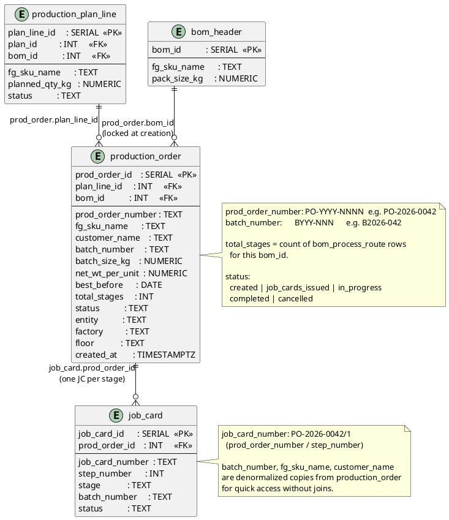

# Production Orders

A production order is created from an approved plan line. It carries one batch through the full process.



## Field Relations Summary

| Field | Table | Points To | Purpose |
|-------|-------|-----------|---------|
| `production_order.plan_line_id` | production_order | `production_plan_line.plan_line_id` | Approved plan line that spawned this order |
| `production_order.bom_id` | production_order | `bom_header.bom_id` | BOM snapshot locked at order creation |
| `job_card.prod_order_id` | job_card | `production_order.prod_order_id` | All job cards belonging to this batch |

## Denormalized Fields on `job_card`

Copied from upstream at creation — do **not** auto-update if upstream changes:

| Field on `job_card` | Copied from |
|---------------------|-------------|
| `fg_sku_name` | `production_order.fg_sku_name` |
| `customer_name` | `production_order.customer_name` |
| `batch_number` | `production_order.batch_number` |
| `batch_size_kg` | `production_order.batch_size_kg` |
| `floor` | `machine.floor` at assignment time |
| `factory` | `machine.factory` at assignment time |

## Status Flow

```
production_order.status:
  created → job_cards_issued → in_progress → completed
           ↘ cancelled (at any stage)
```
