# Job Cards

The core execution unit. One job card per process stage per production order batch.

```plantuml
@startuml Job_Cards
skinparam linetype ortho
skinparam ranksep 55
skinparam nodesep 30
hide empty members

entity "production_order" as PO {
  prod_order_id    : SERIAL  <<PK>>
  --
  prod_order_number : TEXT
  batch_number     : TEXT
}

entity "machine" as MACH {
  machine_id       : SERIAL  <<PK>>
  --
  machine_name     : TEXT
  floor            : TEXT
}

entity "bom_header" as BOM {
  bom_id           : SERIAL  <<PK>>
  --
  fg_sku_name      : TEXT
}

entity "job_card" as JC {
  job_card_id            : SERIAL    <<PK>>
  prod_order_id          : INT       <<FK>>
  bom_id                 : INT       <<FK>>
  machine_id             : INT       <<FK>>
  next_job_card_id       : INT       <<FK>>
  prev_job_card_id       : INT       <<FK>>
  --
  job_card_number        : TEXT
  step_number            : INT
  process_name           : TEXT
  stage                  : TEXT
  fg_sku_name            : TEXT
  customer_name          : TEXT
  batch_number           : TEXT
  batch_size_kg          : NUMERIC
  assigned_to_team_leader : TEXT
  team_members           : TEXT[]
  is_locked              : BOOLEAN
  locked_reason          : TEXT
  force_unlocked         : BOOLEAN
  force_unlock_by        : TEXT
  force_unlock_reason    : TEXT
  force_unlock_at        : TIMESTAMPTZ
  status                 : TEXT
  start_time             : TIMESTAMPTZ
  end_time               : TIMESTAMPTZ
  total_time_min         : NUMERIC
  factory                : TEXT
  floor                  : TEXT
  entity                 : TEXT
  carried_qty_kg         : NUMERIC
  dispatched_to_next_kg  : NUMERIC
  created_at             : TIMESTAMPTZ
}

entity "job_card_partial_dispatch" as JCPD {
  dispatch_id        : SERIAL  <<PK>>
  from_job_card_id   : INT     <<FK>>
  to_job_card_id     : INT     <<FK>>
  --
  qty_kg             : NUMERIC
  dispatched_at      : TIMESTAMPTZ
  dispatched_by      : TEXT
}

entity "job_card_rm_indent" as JCRM {
  rm_indent_id       : SERIAL  <<PK>>
  job_card_id        : INT     <<FK>>
  --
  material_sku_name  : TEXT
  uom                : TEXT
  reqd_qty           : NUMERIC
  loss_pct           : NUMERIC
  gross_qty          : NUMERIC
  issued_qty         : NUMERIC
  batch_no           : TEXT
  godown             : TEXT
  scanned_box_ids    : TEXT[]
  variance           : NUMERIC
  status             : TEXT
}

entity "job_card_pm_indent" as JCPM {
  pm_indent_id       : SERIAL  <<PK>>
  job_card_id        : INT     <<FK>>
  --
  material_sku_name  : TEXT
  uom                : TEXT
  reqd_qty           : NUMERIC
  loss_pct           : NUMERIC
  gross_qty          : NUMERIC
  issued_qty         : NUMERIC
  batch_no           : TEXT
  godown             : TEXT
  scanned_box_ids    : TEXT[]
  variance           : NUMERIC
  status             : TEXT
}

entity "job_card_process_step" as JCPS {
  step_id            : SERIAL  <<PK>>
  job_card_id        : INT     <<FK>>
  --
  step_number        : INT
  process_name       : TEXT
  machine_name       : TEXT
  std_time_min       : NUMERIC
  qc_check           : TEXT
  loss_pct           : NUMERIC
  operator_name      : TEXT
  operator_sign_at   : TIMESTAMPTZ
  qc_sign_at         : TIMESTAMPTZ
  time_done          : TIMESTAMPTZ
  status             : TEXT
}

entity "job_card_output" as JCO {
  output_id          : SERIAL  <<PK>>
  job_card_id        : INT     <<FK>>
  --
  fg_expected_units  : INT
  fg_actual_units    : INT
  fg_expected_kg     : NUMERIC
  fg_actual_kg       : NUMERIC
  rm_consumed_kg     : NUMERIC
  process_loss_kg    : NUMERIC
  net_output_kg      : NUMERIC
  yield_pct          : NUMERIC
  created_at         : TIMESTAMPTZ
}

entity "job_card_environment" as JCENV {
  env_id             : SERIAL  <<PK>>
  job_card_id        : INT     <<FK>>
  --
  parameter_name     : TEXT
  value              : TEXT
  recorded_at        : TIMESTAMPTZ
}

entity "job_card_metal_detection" as JCMD {
  detection_id       : SERIAL  <<PK>>
  job_card_id        : INT     <<FK>>
  --
  check_type         : TEXT
  fe_pass            : BOOLEAN
  nfe_pass           : BOOLEAN
  ss_pass            : BOOLEAN
  failed_units       : INT
  remarks            : TEXT
  recorded_at        : TIMESTAMPTZ
}

entity "job_card_weight_check" as JCWC {
  check_id           : SERIAL  <<PK>>
  job_card_id        : INT     <<FK>>
  --
  sample_number      : INT
  net_weight         : NUMERIC
  gross_weight       : NUMERIC
  leak_test_pass     : BOOLEAN
  recorded_at        : TIMESTAMPTZ
}

entity "job_card_loss_reconciliation" as JCLR {
  recon_id           : SERIAL  <<PK>>
  job_card_id        : INT     <<FK>>
  --
  loss_category      : TEXT
  budgeted_loss_pct  : NUMERIC
  budgeted_loss_kg   : NUMERIC
  actual_loss_kg     : NUMERIC
  variance_kg        : NUMERIC
  remarks            : TEXT
  created_at         : TIMESTAMPTZ
}

entity "job_card_remarks" as JCRK {
  remark_id          : SERIAL  <<PK>>
  job_card_id        : INT     <<FK>>
  --
  remark_type        : TEXT
  content            : TEXT
  recorded_by        : TEXT
  recorded_at        : TIMESTAMPTZ
}

PO   ||--o{ JC   : "job_card.prod_order_id"
MACH ||--o{ JC   : "job_card.machine_id"
BOM  ||--o{ JC   : "job_card.bom_id"
JC   ||--o{ JC   : "next_job_card_id /\nprev_job_card_id\n(stage chain)"
JC   ||--o{ JCPD : "from_job_card_id"
JC   ||--o{ JCPD : "to_job_card_id"
JC   ||--o{ JCRM : "rm_indent.job_card_id"
JC   ||--o{ JCPM : "pm_indent.job_card_id"
JC   ||--o{ JCPS : "process_step.job_card_id"
JC   ||--|| JCO  : "output.job_card_id (1-to-1)"
JC   ||--o{ JCENV : "environment.job_card_id"
JC   ||--o{ JCMD : "metal_detection.job_card_id"
JC   ||--o{ JCWC : "weight_check.job_card_id"
JC   ||--o{ JCLR : "loss_reconciliation.job_card_id"
JC   ||--o{ JCRK : "remarks.job_card_id"

note right of JC
  status:
    locked | unlocked | assigned
    material_received | in_progress
    completed | closed

  Chain: PO-2026-0042/1 → /2 → /3
  carried_qty_kg: received from prev stage
  dispatched_to_next_kg: pushed to next stage
end note

note right of JCRM
  scanned_box_ids[] = po_box.box_id values
  scanned during material receipt (soft ref).
  batch_no = po_section.lot_number (soft ref).
end note

@enduml
```



## Field Relations Summary

| Field | Table | Points To | Purpose |
|-------|-------|-----------|---------|
| `job_card.prod_order_id` | job_card | `production_order.prod_order_id` | Which batch this JC belongs to |
| `job_card.machine_id` | job_card | `machine.machine_id` | Physical machine assigned |
| `job_card.bom_id` | job_card | `bom_header.bom_id` | BOM for reference during execution |
| `job_card.next_job_card_id` | job_card | `job_card.job_card_id` | Next stage in chain |
| `job_card.prev_job_card_id` | job_card | `job_card.job_card_id` | Previous stage in chain |
| `job_card_partial_dispatch.from_job_card_id` | job_card_partial_dispatch | `job_card.job_card_id` | Source stage of material handoff |
| `job_card_partial_dispatch.to_job_card_id` | job_card_partial_dispatch | `job_card.job_card_id` | Destination stage |
| All `*.job_card_id` annexure fields | All annexure tables | `job_card.job_card_id` | Data recorded for this specific JC |
| `job_card_rm_indent.scanned_box_ids` | job_card_rm_indent | `po_box.box_id[]` | Boxes physically scanned (soft ref) |
| `job_card_output.job_card_id` | job_card_output | `job_card.job_card_id` | One-to-one, UNIQUE constraint |

## Job Card Lifecycle

```
locked → unlocked → assigned → material_received → in_progress → completed → closed
                                                                    ↑
                                    force_unlock (any stage) ───────┘
```

## Annexure Mapping

| Table | Annexure | Content |
|-------|----------|---------|
| `job_card_process_step` | Inline steps | Sub-steps within the stage |
| `job_card_output` | Section 5 | FG actual vs expected, yield % |
| `job_card_environment` | Annexure C | Temp, humidity, fan %, etc. |
| `job_card_metal_detection` | Annexure A/B | Fe / NFe / SS pass-fail |
| `job_card_weight_check` | Annexure B | 20-sample weight checks |
| `job_card_loss_reconciliation` | Annexure D | Loss category breakdown |
| `job_card_remarks` | Annexure E | Observations, deviations, corrective actions |
