# Inventory & Store Allocation

Floor inventory, material movement, off-grade stock, reuse rules, purchase indents, and store alerts.

```plantuml
@startuml Inventory_Store
skinparam linetype ortho
skinparam ranksep 65
hide empty members

entity "job_card" as JC {
  job_card_id    : SERIAL  <<PK>>
  --
  batch_number   : TEXT
  fg_sku_name    : TEXT
  stage          : TEXT
  floor          : TEXT
}

entity "production_plan_line" as PPL {
  plan_line_id   : SERIAL  <<PK>>
  --
  fg_sku_name    : TEXT
  planned_qty_kg : NUMERIC
}

entity "so_fulfillment" as SF {
  fulfillment_id : SERIAL  <<PK>>
  --
  fg_sku_name    : TEXT
}

entity "floor_inventory" as FI {
  inventory_id    : SERIAL  <<PK>>
  --
  sku_name        : TEXT
  item_type       : TEXT
  floor_location  : TEXT
  quantity_kg     : NUMERIC
  lot_number      : TEXT
  entity          : TEXT
  last_updated    : TIMESTAMPTZ
}

entity "floor_movement" as FM {
  movement_id      : SERIAL  <<PK>>
  job_card_id      : INT     <<FK>>
  --
  sku_name         : TEXT
  from_location    : TEXT
  to_location      : TEXT
  quantity_kg      : NUMERIC
  reason           : TEXT
  scanned_qr_codes : TEXT[]
  entity           : TEXT
  moved_by         : TEXT
  moved_at         : TIMESTAMPTZ
}

entity "offgrade_inventory" as OGI {
  offgrade_id       : SERIAL  <<PK>>
  job_card_id       : INT     <<FK>>
  --
  source_product    : TEXT
  item_group        : TEXT
  category          : TEXT
  grade             : TEXT
  available_qty_kg  : NUMERIC
  production_date   : DATE
  expiry_date       : DATE
  status            : TEXT
  entity            : TEXT
  created_at        : TIMESTAMPTZ
}

entity "offgrade_reuse_rule" as OGR {
  rule_id                : SERIAL  <<PK>>
  --
  source_item_group      : TEXT
  target_item_group      : TEXT
  max_substitution_pct   : NUMERIC
  is_active              : BOOLEAN
  notes                  : TEXT
  created_at             : TIMESTAMPTZ
}

entity "offgrade_consumption" as OGC {
  consumption_id   : SERIAL  <<PK>>
  offgrade_id      : INT     <<FK>>
  job_card_id      : INT     <<FK>>
  --
  qty_used_kg      : NUMERIC
  consumed_at      : TIMESTAMPTZ
}

entity "purchase_indent" as PI {
  indent_id            : SERIAL  <<PK>>
  plan_line_id         : INT     <<FK>>
  --
  indent_number        : TEXT
  material_sku_name    : TEXT
  required_qty_kg      : NUMERIC
  required_by_date     : DATE
  priority             : INT
  po_reference         : TEXT
  status               : TEXT
  acknowledged_by      : TEXT
  acknowledged_at      : TIMESTAMPTZ
  entity               : TEXT
  created_at           : TIMESTAMPTZ
}

entity "store_alert" as SA {
  alert_id       : SERIAL  <<PK>>
  --
  alert_type     : TEXT
  target_team    : TEXT
  message        : TEXT
  related_id     : INT
  related_type   : TEXT
  is_read        : BOOLEAN
  entity         : TEXT
  created_at     : TIMESTAMPTZ
}

entity "fulfillment_floor_stock" as FFS {
  floor_stock_id       : SERIAL  <<PK>>
  fulfillment_id       : INT     <<FK>>
  --
  material_sku_name    : TEXT
  item_type            : TEXT
  quantity_kg          : NUMERIC
  unit                 : TEXT
  floor_location       : TEXT
  added_by             : TEXT
  notes                : TEXT
  created_at           : TIMESTAMPTZ
  updated_at           : TIMESTAMPTZ
}

JC   ||--o{ FM   : "floor_movement.job_card_id"
JC   ||--o{ OGI  : "offgrade_inventory.job_card_id"
JC   ||--o{ OGC  : "offgrade_consumption.job_card_id"
OGI  ||--o{ OGC  : "offgrade_consumption.offgrade_id"
PPL  ||--o{ PI   : "purchase_indent.plan_line_id"
SF   ||--o{ FFS  : "fulfillment_floor_stock.fulfillment_id"

note right of FI
  UNIQUE(sku_name, floor_location, lot_number, entity)
  item_type: rm | pm | wip | fg
  floor_location: rm_store | pm_store
    | production_floor | fg_store

  quantity_kg is updated by floor_movement
  transactions (not from FM directly in DB;
  updated in application layer).
end note

note right of FM
  reason values:
    production | return | receipt | dispatch
  scanned_qr_codes[] = po_box.box_id (soft ref)
end note

note right of SA
  related_id + related_type = polymorphic FK.
  e.g. related_type='job_card',
       related_id=job_card.job_card_id

  target_team: purchase | stores | production | qc
  alert_type: material_shortage | indent_raised
    | material_received | force_unlock
    | anomaly | plan_ready
end note

note right of FFS
  Manual entry for floor materials not yet
  scanned. Used in MRP availability checks
  to prevent false shortage indents.
  unit: KG or NOS
end note

@enduml
```



## Field Relations Summary

| Field | Table | Points To | Purpose |
|-------|-------|-----------|---------|
| `floor_movement.job_card_id` | floor_movement | `job_card.job_card_id` | Which JC triggered this movement |
| `floor_movement.scanned_qr_codes` | floor_movement | `po_box.box_id[]` | Boxes physically moved (soft ref) |
| `offgrade_inventory.job_card_id` | offgrade_inventory | `job_card.job_card_id` | JC that generated this off-grade |
| `offgrade_consumption.offgrade_id` | offgrade_consumption | `offgrade_inventory.offgrade_id` | Which lot was consumed |
| `offgrade_consumption.job_card_id` | offgrade_consumption | `job_card.job_card_id` | JC that consumed it |
| `purchase_indent.plan_line_id` | purchase_indent | `production_plan_line.plan_line_id` | Plan line that triggered this indent |
| `fulfillment_floor_stock.fulfillment_id` | fulfillment_floor_stock | `so_fulfillment.fulfillment_id` | Which fulfillment this floor stock supports |
| `store_alert.related_id + related_type` | store_alert | Any table | Polymorphic reference |

## Purchase Indent Status Flow

```
raised → acknowledged → po_created → received
       ↘ cancelled
```

## Floor Locations

| `floor_location` | Stores |
|------------------|--------|
| `rm_store` | Raw materials awaiting production |
| `pm_store` | Packaging materials |
| `production_floor` | WIP on the floor |
| `fg_store` | Finished goods awaiting dispatch |
