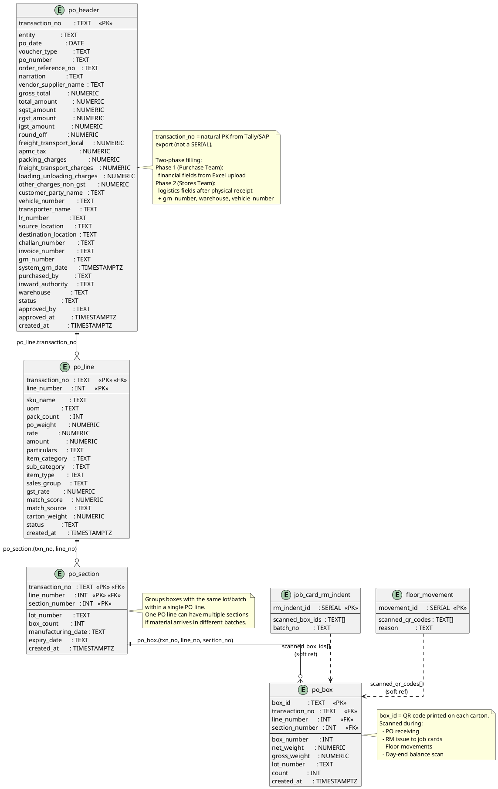

# Purchase Orders & Receiving

PO upload by the purchase team and physical receiving by the stores team with lot/box tracking.



## Field Relations Summary

| Field | Table | Points To | Purpose |
|-------|-------|-----------|---------|
| `po_line.transaction_no` | po_line | `po_header.transaction_no` | Line belongs to this PO header |
| `po_section.(transaction_no, line_number)` | po_section | `po_line.(transaction_no, line_number)` | Section belongs to this PO line |
| `po_box.(transaction_no, line_number, section_number)` | po_box | `po_section.(...)` | Box belongs to this section |
| `po_box.transaction_no` | po_box | `po_header.transaction_no` | Direct shortcut to PO header |
| `job_card_rm_indent.scanned_box_ids` | job_card_rm_indent | `po_box.box_id[]` | Boxes used for RM issue |
| `job_card_rm_indent.batch_no` | job_card_rm_indent | `po_section.lot_number` | Lot traceability (soft ref) |
| `floor_movement.scanned_qr_codes` | floor_movement | `po_box.box_id[]` | Boxes involved in the movement |

## Hierarchy

```
po_header      (1 PO)
  └── po_line       (1 per article/SKU)
        └── po_section    (1 per lot/batch within the line)
              └── po_box       (1 per physical carton — has QR code)
```
