# IMS Module (Internal Material System)

Production indents, internal orders, issue notes, lot blocking, QC inspections, RTV disposition, off-grade, and write-offs.

```plantuml
@startuml IMS_Module
skinparam linetype ortho
skinparam ranksep 55
skinparam nodesep 30
hide empty members

entity "production_indent" as PRDI {
  id                   : SERIAL  <<PK>>
  --
  prod_indent_id       : TEXT    <<UNIQUE>>
  item_description     : TEXT
  item_category        : TEXT
  sub_category         : TEXT
  material_type        : TEXT
  uom                  : TEXT
  required_qty         : NUMERIC
  available_qty        : NUMERIC
  shortfall_qty        : NUMERIC
  triggered_by_job_card : TEXT
  triggered_by_so      : TEXT
  customer_name        : TEXT
  maker_user           : TEXT
  checker_user         : TEXT
  checker_comment      : TEXT
  status               : TEXT
  linked_internal_order : TEXT
  linked_internal_jc   : TEXT
  entity               : TEXT
  created_at           : TIMESTAMPTZ
  approved_at          : TIMESTAMPTZ
  fulfilled_at         : TIMESTAMPTZ
  cancel_reason        : TEXT
}

entity "internal_order" as IORD {
  id                   : SERIAL  <<PK>>
  --
  internal_order_id    : TEXT    <<UNIQUE>>
  prod_indent_id       : TEXT    <<FK>>
  item_description     : TEXT
  material_type        : TEXT
  required_qty         : NUMERIC
  status               : TEXT
  entity               : TEXT
  created_at           : TIMESTAMPTZ
  completed_at         : TIMESTAMPTZ
}

entity "internal_job_card" as IJC {
  id                   : SERIAL  <<PK>>
  --
  internal_jc_id       : TEXT    <<UNIQUE>>
  internal_order_id    : TEXT    <<FK>>
  parent_job_card_id   : TEXT
  parent_so_ref        : TEXT
  fg_sku_name          : TEXT
  status               : TEXT
  bom_data             : JSONB
  entity               : TEXT
  created_at           : TIMESTAMPTZ
  completed_at         : TIMESTAMPTZ
}

entity "issue_note" as ISN {
  id                      : SERIAL  <<PK>>
  --
  issue_note_id           : TEXT    <<UNIQUE>>
  job_card_id             : TEXT
  so_id                   : TEXT
  customer_name           : TEXT
  bom_line_id             : TEXT
  issued_by               : TEXT
  issued_at               : TIMESTAMPTZ
  status                  : TEXT
  reservation_expires_at  : TIMESTAMPTZ
  total_weight_kg         : NUMERIC
  entity                  : TEXT
  created_at              : TIMESTAMPTZ
}

entity "issue_note_line" as ISNL {
  id               : SERIAL  <<PK>>
  issue_note_id    : TEXT    <<FK>>
  --
  bom_line_id      : TEXT
  sku              : TEXT
  material_type    : TEXT
  lot_number       : TEXT
  lot_id           : TEXT
  tr_number        : TEXT
  warehouse        : TEXT
  net_wt_issued    : NUMERIC
  qty_cartons      : INT
  box_id           : TEXT
  fifo_skipped     : BOOLEAN
  skip_reason      : TEXT
}

entity "lot_block" as LB {
  id                  : SERIAL  <<PK>>
  --
  block_id            : TEXT    <<UNIQUE>>
  transaction_no      : TEXT
  lot_number          : TEXT
  batch_id            : TEXT
  blocked_for_so      : TEXT
  blocked_for_customer : TEXT
  blocked_by_user     : TEXT
  blocked_at          : TIMESTAMPTZ
  skip_reason         : TEXT
  comment             : TEXT
  previous_so         : TEXT
  force_assigned_by   : TEXT
  force_assigned_at   : TIMESTAMPTZ
  override_comment    : TEXT
  is_active           : BOOLEAN
}

entity "fifo_skip_log" as FSL {
  id            : SERIAL  <<PK>>
  --
  batch_id      : TEXT
  job_card_id   : TEXT
  reason        : TEXT
  detail        : TEXT
  disposition   : TEXT
  block_for_so  : TEXT
  skipped_by    : TEXT
  skipped_at    : TIMESTAMPTZ
}

entity "qc_inspection" as QCI {
  id               : SERIAL  <<PK>>
  --
  inspection_id    : TEXT    <<UNIQUE>>
  job_card_id      : INT
  jc_number        : TEXT
  fg_sku_name      : TEXT
  customer_name    : TEXT
  floor            : TEXT
  process_step     : TEXT
  checkpoint_type  : TEXT
  inspector_user   : TEXT
  inspection_date  : TIMESTAMPTZ
  result           : TEXT
  findings         : TEXT
  corrective_action : TEXT
  signed_off_at    : TIMESTAMPTZ
  created_at       : TIMESTAMPTZ
}

entity "rtv_disposition" as RTVD {
  id                     : SERIAL  <<PK>>
  --
  disposition_id         : TEXT    <<UNIQUE>>
  rtv_id                 : TEXT
  item_description       : TEXT
  qty                    : NUMERIC
  net_weight             : NUMERIC
  source_type            : TEXT
  disposition_type       : TEXT
  decided_by             : TEXT
  decided_at             : TIMESTAMPTZ
  qc_remarks             : TEXT
  linked_internal_order  : TEXT
  linked_offgrade_lot    : TEXT
  discard_approved       : BOOLEAN
  entity                 : TEXT
  created_at             : TIMESTAMPTZ
}

entity "off_grade_inventory" as OGGI {
  id                      : SERIAL  <<PK>>
  --
  offgrade_id             : TEXT    <<UNIQUE>>
  original_tr_number      : TEXT
  original_lot_number     : TEXT
  item_description        : TEXT
  material_type           : TEXT
  qty                     : NUMERIC
  net_weight              : NUMERIC
  source_type             : TEXT
  source_id               : TEXT
  condition_notes         : TEXT
  disposition             : TEXT
  management_decision_by  : TEXT
  management_decision_at  : TIMESTAMPTZ
  entity                  : TEXT
  created_at              : TIMESTAMPTZ
}

entity "write_off_ledger" as WOL {
  id               : SERIAL  <<PK>>
  --
  rtv_id           : TEXT
  offgrade_id      : TEXT
  item_description : TEXT
  lot_number       : TEXT
  qty              : NUMERIC
  net_weight       : NUMERIC
  reason           : TEXT
  authorised_by    : TEXT
  written_off_at   : TIMESTAMPTZ
}

entity "amendment_log" as AML {
  id              : SERIAL  <<PK>>
  --
  record_id       : TEXT
  record_type     : TEXT
  field_name      : TEXT
  previous_value  : TEXT
  new_value       : TEXT
  changed_by      : TEXT
  changed_at      : TIMESTAMPTZ
  reason          : TEXT
}

PRDI ||--o{ IORD  : "internal_order.prod_indent_id"
IORD ||--o{ IJC   : "internal_job_card.internal_order_id"
ISN  ||--o{ ISNL  : "issue_note_line.issue_note_id"
RTVD ..>   IORD   : "linked_internal_order (soft)"
RTVD ..>   OGGI   : "linked_offgrade_lot (soft)"
OGGI ..>   WOL    : "write_off_ledger.offgrade_id (soft)"

note right of PRDI
  status: draft | submitted | approved
    | internal_jc_created | fulfilled | cancelled

  triggered_by_job_card and triggered_by_so
  are plain TEXT (job card number / SO number)
  — not hard FKs.

  linked_internal_order and linked_internal_jc
  are soft TEXT back-references.
end note

note right of ISNL
  lot_id  -> inventory_batch.batch_id (soft)
  tr_number -> po_header.transaction_no (soft)
  box_id  -> po_box.box_id (soft)
end note

note right of AML
  Polymorphic audit log.
  record_type examples:
    'production_indent', 'issue_note',
    'rtv_disposition', 'internal_order'
  record_id = human-readable ID of the record.
end note

@enduml
```

## Field Relations Summary

| Field | Table | Points To | Purpose |
|-------|-------|-----------|---------|
| `internal_order.prod_indent_id` | internal_order | `production_indent.prod_indent_id` | Order raised to fulfill this indent |
| `internal_job_card.internal_order_id` | internal_job_card | `internal_order.internal_order_id` | JC created for the internal order |
| `production_indent.linked_internal_order` | production_indent | `internal_order.internal_order_id` | Back-link (soft TEXT ref) |
| `issue_note_line.issue_note_id` | issue_note_line | `issue_note.issue_note_id` | Line belongs to this issue note |
| `issue_note_line.lot_id` | issue_note_line | `inventory_batch.batch_id` | Batch picked for issue (soft ref) |
| `issue_note_line.box_id` | issue_note_line | `po_box.box_id` | Physical box issued (soft ref) |
| `rtv_disposition.linked_internal_order` | rtv_disposition | `internal_order.internal_order_id` | Reprocess order for RTV material |
| `rtv_disposition.linked_offgrade_lot` | rtv_disposition | `off_grade_inventory.offgrade_id` | Off-grade lot created from RTV |
| `write_off_ledger.offgrade_id` | write_off_ledger | `off_grade_inventory.offgrade_id` | Off-grade lot that was written off |
| `amendment_log.record_id + record_type` | amendment_log | Any IMS table | Polymorphic audit trail |

## ID Formats

| Table | ID Format | Example |
|-------|-----------|---------|
| `production_indent` | `PRDI-YYYYMMDD-NNN` | `PRDI-20260413-001` |
| `internal_order` | `INT-ORD-YYYYMMDD-NNN` | `INT-ORD-20260413-001` |
| `internal_job_card` | `INT-JC-YYYYMMDD-NNN` | `INT-JC-20260413-001` |
| `issue_note` | `ISN-YYYYMMDD-NNN` | `ISN-20260413-001` |
| `qc_inspection` | `QCI-YYYYMMDD-NNN` | `QCI-20260413-001` |
| `rtv_disposition` | `RTVD-YYYYMMDD-NNN` | `RTVD-20260413-001` |
| `off_grade_inventory` | `OGI-YYYYMMDD-NNN` | `OGI-20260413-001` |
