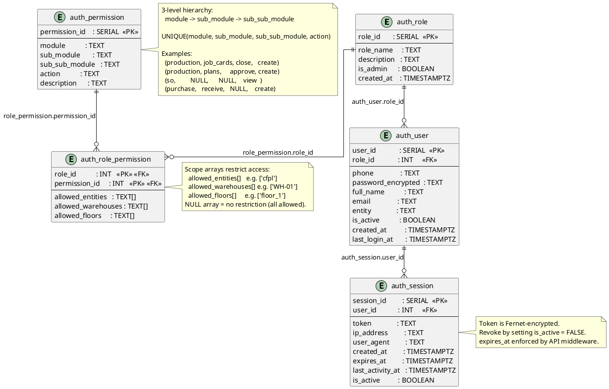

# Auth & Access Control

Users, roles, hierarchical permissions, role-permission mapping, and DB-managed sessions.



## Field Relations Summary

| Field | Table | Points To | Purpose |
|-------|-------|-----------|---------|
| `auth_user.role_id` | auth_user | `auth_role.role_id` | User's assigned role |
| `auth_role_permission.role_id` | auth_role_permission | `auth_role.role_id` | Role side of the mapping |
| `auth_role_permission.permission_id` | auth_role_permission | `auth_permission.permission_id` | Permission side of the mapping |
| `auth_session.user_id` | auth_session | `auth_user.user_id` | Session belongs to a user |

## Permission Check Logic

```
To check if user U can perform action A on module M / sub_module S:

  1. Get role_id from auth_user WHERE user_id = U
  2. Find permission_id from auth_permission WHERE
       module = M AND sub_module = S AND action = A
  3. Check auth_role_permission WHERE
       role_id = role_id AND permission_id = permission_id
  4. Validate allowed_entities / allowed_floors scope if set
```

## Default Roles

| Role | Key Access |
|------|-----------|
| `admin` | All permissions |
| `planner` | plans, fulfillment, MRP, indents, AI |
| `stores_manager` | inventory, day_end, offgrade |
| `team_leader` | job_cards lifecycle & output |
| `qc_inspector` | job_cards annexures + sign_offs |
| `floor_manager` | inventory, day_end, discrepancy |
| `purchase_manager` | purchase module + indents view |
| `viewer` | All `view` actions only |
