# Analytics, Yield, Day-End & AI Log

Process loss, yield summaries, day-end balance scan, discrepancy reports, and AI recommendation log.

```plantuml
@startuml Analytics
skinparam linetype ortho
skinparam ranksep 65
hide empty members

entity "job_card" as JC {
  job_card_id    : SERIAL  <<PK>>
  --
  batch_number   : TEXT
  fg_sku_name    : TEXT
  stage          : TEXT
}

entity "machine" as MACH {
  machine_id     : SERIAL  <<PK>>
  --
  machine_name   : TEXT
}

entity "production_plan" as PP {
  plan_id        : SERIAL  <<PK>>
  --
  plan_date      : DATE
  entity         : TEXT
}

entity "so_fulfillment" as SF {
  fulfillment_id : SERIAL  <<PK>>
  --
  fg_sku_name    : TEXT
  pending_qty_kg : NUMERIC
}

entity "process_loss" as PL {
  loss_id          : SERIAL  <<PK>>
  job_card_id      : INT     <<FK>>
  --
  product_name     : TEXT
  item_group       : TEXT
  machine_name     : TEXT
  stage            : TEXT
  loss_kg          : NUMERIC
  loss_pct         : NUMERIC
  loss_category    : TEXT
  batch_number     : TEXT
  production_date  : DATE
  entity           : TEXT
  created_at       : TIMESTAMPTZ
}

entity "quality_inspection" as QI {
  inspection_id    : SERIAL  <<PK>>
  job_card_id      : INT     <<FK>>
  --
  inspection_type  : TEXT
  checkpoint       : TEXT
  result           : TEXT
  notes            : TEXT
  inspector_name   : TEXT
  entity           : TEXT
  inspected_at     : TIMESTAMPTZ
}

entity "yield_summary" as YS {
  yield_id           : SERIAL  <<PK>>
  --
  product_name       : TEXT
  item_group         : TEXT
  period             : TEXT
  total_input_kg     : NUMERIC
  total_output_kg    : NUMERIC
  yield_pct          : NUMERIC
  total_loss_kg      : NUMERIC
  total_offgrade_kg  : NUMERIC
  entity             : TEXT
  computed_at        : TIMESTAMPTZ
}

entity "ai_recommendation" as AIR {
  recommendation_id    : SERIAL  <<PK>>
  plan_id              : INT     <<FK>>
  --
  recommendation_type  : TEXT
  entity               : TEXT
  prompt_text          : TEXT
  response_text        : TEXT
  response_json        : JSONB
  tokens_used          : INT
  latency_ms           : INT
  model_used           : TEXT
  status               : TEXT
  feedback             : TEXT
  created_at           : TIMESTAMPTZ
}

entity "day_end_balance_scan" as DEBS {
  scan_id             : SERIAL  <<PK>>
  --
  floor_location      : TEXT
  scan_date           : DATE
  submitted_by        : TEXT
  submitted_at        : TIMESTAMPTZ
  reviewed_by         : TEXT
  reviewed_at         : TIMESTAMPTZ
  total_system_qty    : NUMERIC
  total_scanned_qty   : NUMERIC
  total_variance      : NUMERIC
  status              : TEXT
  entity              : TEXT
  created_at          : TIMESTAMPTZ
}

entity "day_end_balance_scan_line" as DEBSL {
  scan_line_id       : SERIAL  <<PK>>
  scan_id            : INT     <<FK>>
  --
  sku_name           : TEXT
  item_type          : TEXT
  system_qty_kg      : NUMERIC
  scanned_qty_kg     : NUMERIC
  variance_kg        : NUMERIC
  variance_pct       : NUMERIC
  scanned_box_ids    : TEXT[]
  variance_reason    : TEXT
  corrective_action  : TEXT
  status             : TEXT
}

entity "discrepancy_report" as DR {
  discrepancy_id        : SERIAL  <<PK>>
  affected_machine_id   : INT     <<FK>>
  --
  discrepancy_type      : TEXT
  severity              : TEXT
  affected_material     : TEXT
  affected_job_card_ids : INT[]
  affected_plan_line_ids : INT[]
  details               : TEXT
  total_affected_qty_kg : NUMERIC
  customer_impact       : TEXT
  resolution_type       : TEXT
  resolution_details    : TEXT
  reported_by           : TEXT
  reported_at           : TIMESTAMPTZ
  resolved_by           : TEXT
  resolved_at           : TIMESTAMPTZ
  status                : TEXT
  entity                : TEXT
  created_at            : TIMESTAMPTZ
}

entity "fulfillment_floor_stock" as FFS {
  floor_stock_id       : SERIAL  <<PK>>
  fulfillment_id       : INT     <<FK>>
  --
  material_sku_name    : TEXT
  item_type            : TEXT
  quantity_kg          : NUMERIC
  unit                 : TEXT
  floor_location       : TEXT
  added_by             : TEXT
  notes                : TEXT
  created_at           : TIMESTAMPTZ
  updated_at           : TIMESTAMPTZ
}

JC   ||--o{ PL    : "process_loss.job_card_id"
JC   ||--o{ QI    : "quality_inspection.job_card_id"
PP   ||--o{ AIR   : "ai_recommendation.plan_id"
DEBS ||--o{ DEBSL : "scan_line.scan_id"
MACH ||--o{ DR    : "discrepancy_report.affected_machine_id"
SF   ||--o{ FFS   : "fulfillment_floor_stock.fulfillment_id"

note right of PL
  Auto-created from job_card_output
  when a job card completes.
  loss_category: sorting | roasting
    | packaging | metal_detection | spillage
end note

note right of YS
  Aggregated periodically (not real-time).
  period format:
    '2026-04'   monthly
    '2026-W14'  weekly
end note

note right of DR
  affected_job_card_ids[] and
  affected_plan_line_ids[] are INT arrays
  — soft refs, no DB FK constraints.

  severity: critical | major | minor
  status: open | investigating | resolved | closed
end note

note right of DEBS
  UNIQUE(floor_location, scan_date, entity)
  status: pending | submitted
    | variance_flagged | reconciled
end note

note right of FFS
  Manual entry for floor materials not yet
  scanned. Used in MRP availability check
  to avoid raising false shortage indents.
end note

@enduml
```



## Field Relations Summary

| Field | Table | Points To | Purpose |
|-------|-------|-----------|---------|
| `process_loss.job_card_id` | process_loss | `job_card.job_card_id` | JC that produced this loss |
| `quality_inspection.job_card_id` | quality_inspection | `job_card.job_card_id` | QC check for this JC |
| `ai_recommendation.plan_id` | ai_recommendation | `production_plan.plan_id` | Plan this AI suggestion was for |
| `day_end_balance_scan_line.scan_id` | day_end_balance_scan_line | `day_end_balance_scan.scan_id` | Line belongs to this scan header |
| `discrepancy_report.affected_machine_id` | discrepancy_report | `machine.machine_id` | Machine involved in the discrepancy |
| `discrepancy_report.affected_job_card_ids` | discrepancy_report | `job_card.job_card_id[]` | Affected JCs (array, soft ref) |
| `fulfillment_floor_stock.fulfillment_id` | fulfillment_floor_stock | `so_fulfillment.fulfillment_id` | Floor stock for this fulfillment |

## Day-End Status Flow

```
pending → submitted → variance_flagged → reconciled
                    ↘ reconciled (if no variance)
```
