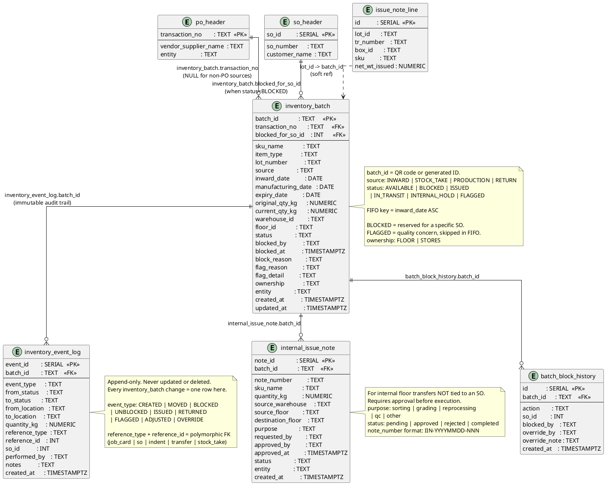

# Inventory Batch Ledger

Single source of truth for all batch-level inventory. Tracks FIFO ordering, SO blocking, and a complete immutable event log.



## Field Relations Summary

| Field | Table | Points To | Purpose |
|-------|-------|-----------|---------|
| `inventory_batch.transaction_no` | inventory_batch | `po_header.transaction_no` | PO that brought in this batch (NULL for production) |
| `inventory_batch.blocked_for_so_id` | inventory_batch | `so_header.so_id` | SO this batch is reserved for |
| `inventory_event_log.batch_id` | inventory_event_log | `inventory_batch.batch_id` | Event belongs to this batch |
| `batch_block_history.batch_id` | batch_block_history | `inventory_batch.batch_id` | Block/unblock event for this batch |
| `internal_issue_note.batch_id` | internal_issue_note | `inventory_batch.batch_id` | Batch being transferred internally |
| `issue_note_line.lot_id` | issue_note_line (IMS) | `inventory_batch.batch_id` | Soft cross-reference from IMS module |
| `inventory_event_log.reference_id + reference_type` | inventory_event_log | Any table | Polymorphic reference to the triggering record |

## Batch Status Flow

```
AVAILABLE   --> (FIFO pick)        --> ISSUED
            --> (SO block)         --> BLOCKED
            --> (QC flag)          --> FLAGGED
            --> (floor move)       --> IN_TRANSIT --> AVAILABLE
            --> (hold)             --> INTERNAL_HOLD
BLOCKED     --> (override/cancel)  --> AVAILABLE
            --> (issued to JC)     --> ISSUED
FLAGGED     --> (cleared)          --> AVAILABLE
            --> (write-off)        --> off_grade_inventory
```

## FIFO Pick Logic

```
SELECT * FROM inventory_batch
WHERE sku_name    = :sku
  AND entity      = :entity
  AND status      = 'AVAILABLE'
  AND (blocked_for_so_id IS NULL
       OR blocked_for_so_id = :current_so_id)
ORDER BY inward_date ASC
LIMIT 1
```
