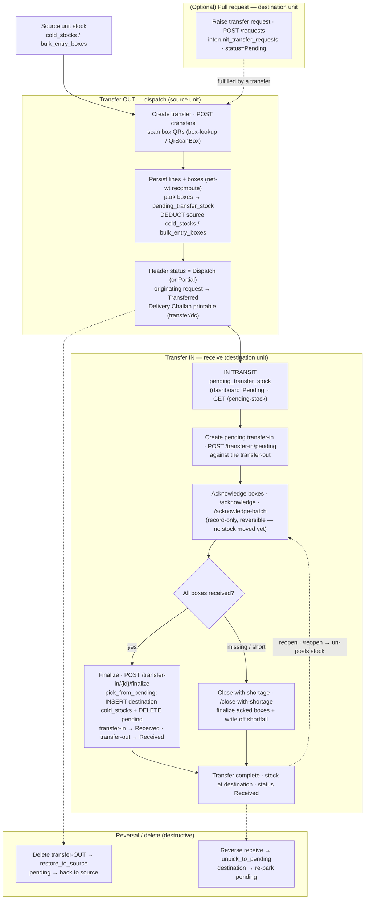
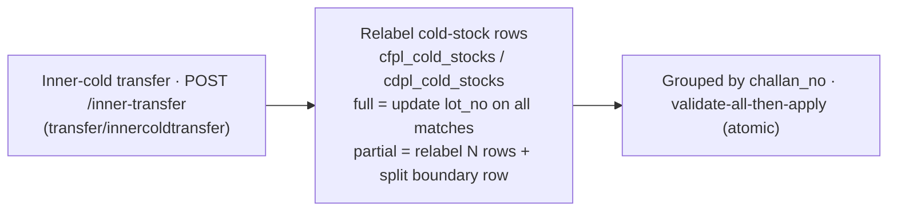

# Candor inter-unit transfer flow — Request → Dispatch → In-transit → Receive

Movement of stock between units/cold stores in the v2 stack: an optional pull
request, a source-unit dispatch (delivery challan) that parks boxes in transit,
and a destination-unit receipt that acknowledges boxes and finalizes them into
stock — plus reversal paths. Endpoints, statuses, and tables below are the real
ones in `server_replica/app/modules/transfer` (base path `/api/v1/transfer`).

## Flow diagram

## Inner-cold transfer (separate — a re-lot, not a cross-unit move)

## Phase → mechanics

| Phase | Endpoint(s) | Key tables | Effect |
|---|---|---|---|
| Request (optional) | `POST /requests` · `GET/DELETE /requests/{id}` | `interunit_transfer_requests` (+ lines) | request raised · `status=Pending` |
| Transfer out | `POST /transfers` · `PUT /transfers/{id}` · box-lookup | `interunit_transfers_header` (+ lines/boxes), **`pending_transfer_stock`**, source `cold_stocks`/`bulk_entry_boxes` | boxes parked in transit · **source deducted** · status `Dispatch`/`Partial` · request → `Transferred` |
| In transit | `GET /pending-stock` · `…/by-lot` | `pending_transfer_stock` | dispatched-not-received tracking |
| Transfer in — open | `POST /transfer-in/pending` · `…/by-transfer-out/{id}` | `interunit_transfer_in_header/_boxes` | pending receipt opened |
| Transfer in — ack | `POST …/{id}/acknowledge` · `/acknowledge-batch` · `DELETE …/acknowledge/{box}` | `interunit_transfer_in_boxes` | box-by-box ack (**record-only, reversible**) |
| Transfer in — finalize | `POST …/{id}/finalize` · `/close-with-shortage` · `/reopen` | destination `cold_stocks`, `pending_transfer_stock` | **stock posted to destination** · pending cleared (or shortage reconciled) |
| Reversal / delete | `DELETE /transfers/{id}` · `DELETE /transfer-in/{id}` · `POST /pending-stock/backfill` | `restore_to_source` / `unpick_to_pending` | atomic rollback of dispatch or receipt |
| Inner-cold | `POST /inner-transfer` · list/get/delete | `cfpl_cold_stocks` / `cdpl_cold_stocks` | lot re-label (full / partial split) — no cross-unit move |

## Notes

- **Where stock actually moves.** Dispatch **deducts the source and parks boxes
  in `pending_transfer_stock`** (in one atomic transaction); receipt
  **acknowledgement is record-only and reversible** — inventory only lands at
  the destination on **finalize** (posts to `cold_stocks`). So a box in transit
  is off the source books and not yet on the destination's: it lives in the
  pending table, which is what the dashboard "Pending" view reads.
- **Statuses are text.** Transfer-out headers carry `Dispatch` / `Partial`
  (recomputed from the boxes shipped vs ordered) and flip to `Received` on
  finalize; transfer-in headers go `Pending → Received` (finalize needs
  ≥ 1 acknowledged box) and back to `Pending` on reopen; the request row flips
  `Pending → Transferred` when a transfer consumes it.
- **Box integrity guard.** A duplicate `(box_id, transaction_no)` is rejected on
  persist — the guard against the "boxes collapsed to 1" inventory-loss bug;
  each scanned box is matched to its line by article.
- **Edits & reversal are safe.** `update_transfer` first rolls prior pending rows
  back to source (`restore_to_source`) before re-parking; deleting a transfer-out
  restores source, and reversing a receipt re-parks pending (`unpick_to_pending`)
  — every path is transactional so a partial failure never strands stock.
- **Inner-cold ≠ inter-unit.** The inner-cold transfer only re-labels lot numbers
  on cold-stock rows within a store (full, or partial with a boundary-row split);
  it does not park to `pending_transfer_stock` or cross units.
- **Relation to the other flows** — transferred RM/SFG/FG is the same inventory
  the [purchase flow](./purchase-flow.md) inwards and the
  [production flow](./so-to-jobcard-flow.md) consumes; a transfer just relocates
  it between units.
