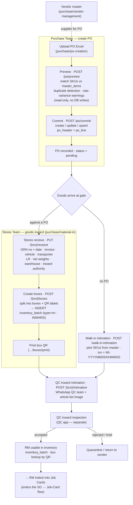

# Candor purchase flow — Vendor / PO → Goods inward → RM stock

End-to-end procurement path in the v2 stack: from a purchase order (or a
no-PO walk-in) through stores receipt, boxing/QR, and QC intimation, to raw
material landing in inventory — where it feeds the
[SO → Job-Card flow](./so-to-jobcard-flow.md) as an RM indent.
Endpoints and tables below are the real ones in `server_replica/app/modules/purchase`.

## Flow diagram

## Phase → mechanics

| Phase | Endpoint(s) | Key tables | Result |
|---|---|---|---|
| Vendor master | `purchase/vendor-management` CRUD | vendor tables | supplier available for POs |
| PO preview | `POST /po/preview` | reads `master_items`, `po_header` | matched lines, warnings — **no writes** |
| PO commit | `POST /po/commit` | `po_header`, `po_line` | PO stored · `status=pending` |
| Stores receive | `PUT /{txn}/receive` | `po_header` (GRN, logistics) | goods-inward + GRN recorded |
| Boxing | `POST /{txn}/boxes` · `…/boxes/print` | `po_box`, **`inventory_batch` (rm · INWARD)** | RM posted to stock + QR labels |
| QC intimation | `POST /{txn}/intimation` | QC arrivals log | QC team notified (WhatsApp) |
| Walk-in (no PO) | `POST /walk-in-intimation` | QC arrivals (`WI-*` txn) | ad-hoc arrival logged + QC notified |
| QC inspection | QC app (separate) | — | accept → usable · reject → quarantine/return |

## Notes

- **Two entry paths.** Material either arrives **against a PO** (Purchase Team
  ingested it first → Stores receives against that `TR-*` transaction) or as a
  **walk-in** with no PO (`WI-*` transaction generated on the spot from the SKU
  master). Both converge on the QC inward intimation.
- **When stock is created.** RM enters inventory at **box creation**
  (`inventory_batch` type `rm`, movement `INWARD`) — not at PO commit and not at
  QC. QC inward intimation is a best-effort WhatsApp notification (arrivals are
  persisted first so they survive a WA outage); the actual pass/fail inspection
  lives in the separate QC app.
- **No PO approval gate.** `preview → commit` *is* the creation; a committed PO
  is immediately `pending`. Lines are replaced wholesale on update (the preview
  Excel is treated as the source of truth for that PO).
- **Hand-off to production.** Boxed, QC-cleared RM is what the production side
  indents onto a job card (`job_card_rm_indent_v2`) — the join point with
  [so-to-jobcard-flow.md](./so-to-jobcard-flow.md).
