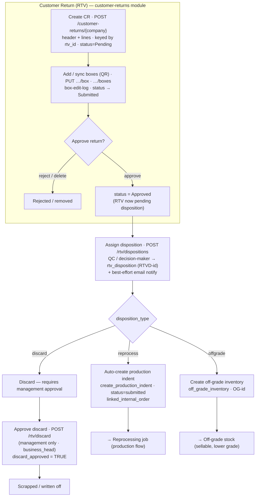
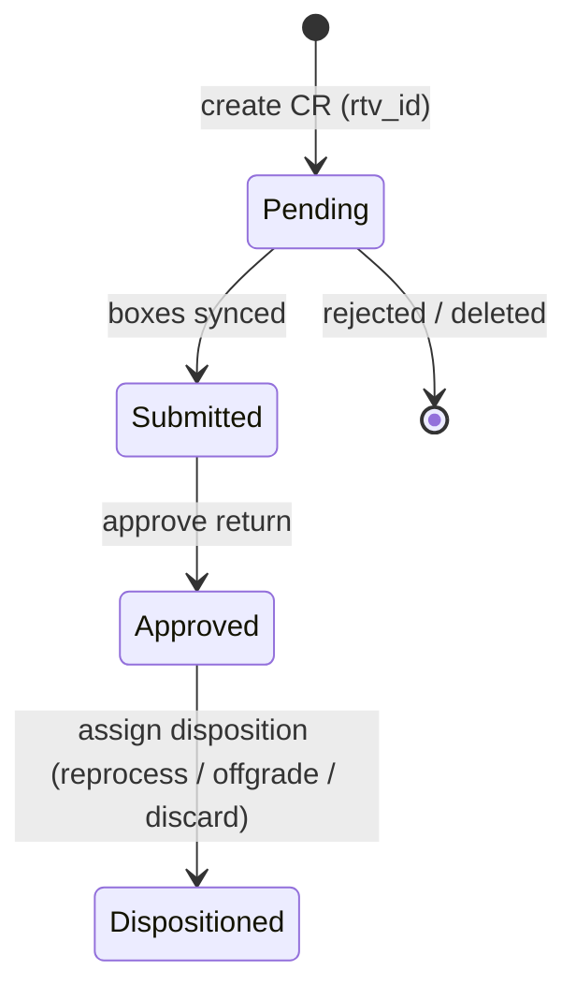

# Candor RTV flow — Customer Return → Approval → Disposition

Return-to-vendor / customer-return lifecycle in the v2 stack: a customer return
is captured (header + lines + boxes, keyed by `rtv_id`), moved through
Pending → Submitted → Approved, then given a **disposition** (reprocess /
off-grade / discard) that routes the goods back into production, into off-grade
stock, or to scrap. CRUD lives in `app/modules/customer_returns`; the
disposition decision lives in `app/modules/production` (`rtv_disposition_service`).

## Flow diagram

## RTV status lifecycle

## Phase → mechanics

| Phase | Endpoint(s) | Key tables | Result |
|---|---|---|---|
| Create return | `POST /customer-returns/{company}` | CR header + lines (keyed `rtv_id`) | `status=Pending` |
| Edit lines / boxes | `PUT …/{cr_id}/lines` · `/box` · `/boxes` · `POST /box-edit-log` | CR lines + boxes | boxes synced → `status=Submitted` |
| Approve | approve action (`web: customer-returns/{id}/approve`) | CR header | `status=Approved` — pending disposition |
| Assign disposition | `POST /rtv/dispositions` | `rtv_disposition` (RTVD-id) | routes the return (below) + email notify |
| → reprocess | (within disposition) `create_production_indent` | `production_indent` (`status=submitted`) | `linked_internal_order` → back into production |
| → offgrade | (within disposition) | `off_grade_inventory` (OG-id) | goods become off-grade sellable stock |
| → discard | (within disposition) then `POST /rtv/discard` | `rtv_disposition.discard_approved` | management-approved write-off |
| List / export | `GET /rtv/dispositions` · `GET /customer-returns/{company}/export` | — | queue of RTVs pending / dispositioned |

## Notes

- **Two modules, one flow.** The return document (CRUD, boxes, statuses) lives in
  `customer_returns`; the **disposition decision** (`/rtv/dispositions`,
  `/rtv/discard`) lives in `production` because its outcomes feed production /
  inventory. `list_dispositions` treats `status='approved'` as "RTVs awaiting a
  disposition".
- **Three real dispositions — no silent restock.** The only outcomes in code are
  **reprocess**, **offgrade**, **discard**. There is deliberately no "return to
  fresh FG stock" path — returned goods are always reworked, down-graded, or
  scrapped.
- **reprocess loops back to production.** It auto-creates a production indent
  (`create_production_indent`, `status=submitted`) and stores its id as
  `linked_internal_order`, so the returned FG re-enters the
  [SO → Job-Card flow](./so-to-jobcard-flow.md) as a rework order.
- **offgrade lands in off-grade inventory.** An `off_grade_inventory` row (OG-id)
  is created with `source_type='RTV'` — the same off-grade bucket production
  writes to; it becomes sellable at a lower grade.
- **discard is two-step.** Assigning `discard` only records the intent; goods are
  not written off until **management approves** (`/rtv/discard` →
  `discard_approved=TRUE`, gated on a valid `business_head`).
- **Notifications.** Every disposition fires a best-effort email
  (`send_rtv_disposition_email`) — it never blocks the write.
- **Relation to the other flows** — reprocess re-enters
  [production](./so-to-jobcard-flow.md); off-grade shares the inventory the
  [purchase](./purchase-flow.md) and [transfer](./interunit-transfer-flow.md)
  flows also touch.
