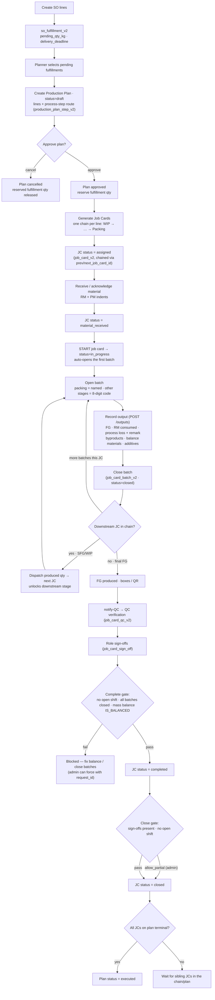
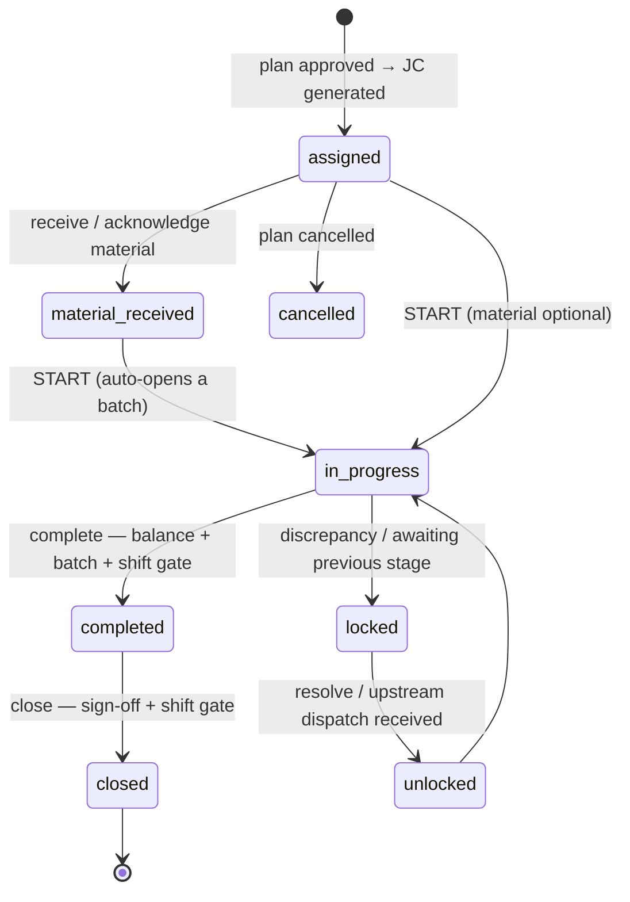

# Candor production flow — Sales Order → Job Card close

End-to-end process for the v2 production stack, from a sales order landing in
fulfillment through to a job card closing and its plan flipping to `executed`.
Statuses, tables, and endpoints below are the real ones in `server_replica`.

## Flow diagram

## Job-card status lifecycle

## Phase → mechanics

| Phase | Endpoint(s) | Key tables | Status after |
|---|---|---|---|
| 1 · Sales Order | `POST /fulfillment-v2/by-so-lines` | `so_fulfillment_v2` | pending (fulfillment) |
| 2 · Plan | `POST /plans-v2` → `POST /plans-v2/{id}/approve` | `production_plan_v2`, `_line_v2`, `_step_v2` | draft → approved |
| 3 · Job cards | generated by approve (`create_job_cards_for_line`) | `job_card_v2` (chained) | assigned |
| 4 · Material | `POST /job-cards-v2/{id}/receive-material` · `/acknowledge-material` | `job_card_rm_indent_v2`, `_pm_indent_v2` | material_received |
| 5 · Start | `PUT /job-cards-v2/{id}/start` | `job_card_batch_v2` (auto-open) | in_progress |
| 6 · Batch run | `POST …/batches/open` · `POST …/outputs` · `POST …/batches/{id}/close` | `job_card_output_v2`, `_consumption_v2`, `_byproducts_v2`, `_balance_material_v2`, `_batch_v2` | (per-batch open → closed) |
| 6b · Chain dispatch | `close` auto-dispatch · `POST …/dispatch-to-next` | `job_card_partial_dispatch_v2` | downstream unlocked |
| 7 · QC & sign-off | `POST …/notify-qc` · `POST …/sign-off` | `job_card_qc_v2`, `job_card_sign_off` | — |
| 8 · Complete | `PUT /job-cards-v2/{id}/complete` | `job_card_accounting_v2` (IS_BALANCED) | completed |
| 9 · Close | `PUT /job-cards-v2/{id}/close` | `job_card_v2` · plan roll-up | closed → plan `executed` |

## Notes

- **Chains** — a plan line with WIP + packing steps becomes a chain of job cards
  linked by `prev_job_card_id` / `next_job_card_id`. Each non-final stage produces
  SFG/WIP that its batch close **dispatches** to the next JC, which unlocks it
  (`awaiting_previous_stage`). The final packing JC produces FG.
- **Split carding** — one line can be carded across several chains (partial qty
  now, the balance later); the plan line is only released when Σ head-card qty
  covers the planned qty.
- **Complete vs close** — *complete* enforces the mass-balance / batch / shift
  gate; *close* enforces sign-offs. Only after **every** JC on the plan reaches a
  terminal state does the plan auto-flip to `executed`.
- **Batch code** — batches use the same 8-digit `new_short_time_id()` as the job
  card id; packing batches may carry an operator-typed name, other stages open
  nameless and are identified by that code.
